# Design Modelling

## UML Models Overview

This document contains the architectural and behavioural UML diagrams for the **Unified Patient Access & Clinical Intelligence Platform**. The diagrams are derived from the functional requirements in `spec.md` (42 FRs, 20 Use Cases) and the architectural decisions in `design.md` (Clean Architecture, CQRS-Light, Hybrid AI pattern).

**Document Navigation:**

- **Architectural Views** — Component Architecture (system decomposition), Deployment Architecture (infrastructure topology), Data Flow (processing pipelines), Logical Data Model (ERD with all 16 domain entities), and AI Architecture (Hybrid NLP pipeline + AI sequence diagrams).
- **Use Case Sequence Diagrams** — One Mermaid sequence diagram per UC-XXX (UC-001 through UC-020), showing actor interactions, success flows, alternative paths, and error handling.

---

## Architectural Views

### Component Architecture Diagram

<!-- RENDER type="mermaid" src="./uml-models/component-architecture.png" -->

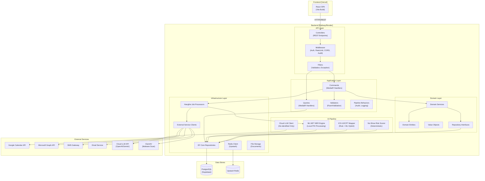
```mermaid
graph TB
    subgraph "Frontend [Vercel]"
        SPA["React SPA<br/>(Vite Build)"]
    end

    subgraph "Backend [Railway/Render]"
        subgraph "API Layer"
            Controllers["Controllers<br/>(REST Endpoints)"]
            Middleware["Middleware<br/>(Auth, RateLimit, CORS, Audit)"]
            Filters["Filters<br/>(Validation, Exception)"]
        end

        subgraph "Application Layer"
            Commands["Commands<br/>(MediatR Handlers)"]
            Queries["Queries<br/>(MediatR Handlers)"]
            Validators["Validators<br/>(FluentValidation)"]
            PipelineBehaviors["Pipeline Behaviors<br/>(Audit, Logging)"]
        end

        subgraph "Domain Layer"
            Entities["Domain Entities"]
            ValueObjects["Value Objects"]
            DomainServices["Domain Services"]
            Interfaces["Repository Interfaces"]
        end

        subgraph "Infrastructure Layer"
            EFCore["EF Core Repositories"]
            RedisClient["Redis Client<br/>(Upstash)"]
            FileStorage["File Storage<br/>(Documents)"]
            ExternalClients["External Service Clients"]
            HangfireJobs["Hangfire Job Processors"]
        end

        subgraph "AI Pipeline"
            MLNet["ML.NET NER Engine<br/>(Local PHI Processing)"]
            CloudLLM["Cloud LLM Client<br/>(De-identified Only)"]
            CodeMapper["ICD-10/CPT Mapper<br/>(Rule + ML Hybrid)"]
            RiskScorer["No-Show Risk Scorer<br/>(Deterministic)"]
        end
    end

    subgraph "Data Stores"
        PostgreSQL[("PostgreSQL<br/>(Supabase)")]
        Redis[("Upstash Redis")]
    end

    subgraph "External Services"
        GoogleCal["Google Calendar API"]
        MSGraph["Microsoft Graph API"]
        SMSGateway["SMS Gateway"]
        EmailSvc["Email Service"]
        OpenAI["Cloud LLM API<br/>(OpenAI/Gemini)"]
        ClamAV["ClamAV<br/>(Malware Scan)"]
    end

    SPA -->|"HTTPS/REST"| Controllers
    Controllers --> Middleware
    Middleware --> Filters
    Filters --> Commands
    Filters --> Queries
    Commands --> Validators
    Commands --> DomainServices
    Queries --> EFCore
    DomainServices --> Entities
    DomainServices --> Interfaces
    Interfaces --> EFCore
    EFCore --> PostgreSQL
    RedisClient --> Redis
    Commands --> HangfireJobs
    HangfireJobs --> MLNet
    HangfireJobs --> ExternalClients
    CloudLLM --> OpenAI
    ExternalClients --> GoogleCal
    ExternalClients --> MSGraph
    ExternalClients --> SMSGateway
    ExternalClients --> EmailSvc
    ExternalClients --> ClamAV
    MLNet --> EFCore
    CodeMapper --> EFCore
    RiskScorer --> EFCore
```

---

### Deployment Architecture Diagram

<!-- RENDER type="plantuml" src="./uml-models/deployment-architecture.png" -->

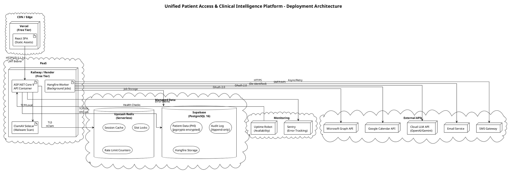
```plantuml
@startuml deployment-architecture
!theme plain
skinparam linetype ortho

title Unified Patient Access & Clinical Intelligence Platform - Deployment Architecture

cloud "CDN / Edge" as edge {
    node "Vercel\n(Free Tier)" as vercel {
        artifact "React SPA\n(Static Assets)" as spa
    }
}

cloud "PaaS" as paas {
    node "Railway / Render\n(Free Tier)" as railway {
        artifact "ASP.NET Core 9\nAPI Container" as api
        artifact "Hangfire Worker\n(Background Jobs)" as hangfire
        artifact "ClamAV Sidecar\n(Malware Scan)" as clamav
    }
}

cloud "Managed Data" as data {
    database "Supabase\n(PostgreSQL 16)" as pg {
        storage "Patient Data (PHI)\n[pgcrypto encrypted]" as phi
        storage "Audit Log\n[Append-only]" as audit
        storage "Hangfire Storage" as hfstorage
    }
    database "Upstash Redis\n(Serverless)" as redis {
        storage "Session Cache" as sessions
        storage "Slot Locks" as locks
        storage "Rate Limit Counters" as ratelimit
    }
}

cloud "External APIs" as external {
    node "Google Calendar API" as gcal
    node "Microsoft Graph API" as msgraph
    node "SMS Gateway" as sms
    node "Email Service" as email
    node "Cloud LLM API\n(OpenAI/Gemini)" as llm
}

cloud "Monitoring" as monitoring {
    node "Sentry\n(Error Tracking)" as sentry
    node "Uptime Robot\n(Availability)" as uptime
}

spa --> api : HTTPS/TLS 1.2+\nJWT Bearer
api --> pg : TCP/SSL\nEF Core
api --> redis : TLS\nnClam
api --> clamav : TCP/Local
hangfire --> pg : Job Storage
hangfire --> gcal : OAuth 2.0
hangfire --> msgraph : OAuth 2.0
hangfire --> sms : Async/Retry
hangfire --> email : SMTP/API
hangfire --> llm : HTTPS\n(De-identified)
api --> sentry : Error Events
uptime --> api : Health Checks
@enduml
```

---

### Data Flow Diagram

<!-- RENDER type="plantuml" src="./uml-models/data-flow.png" -->

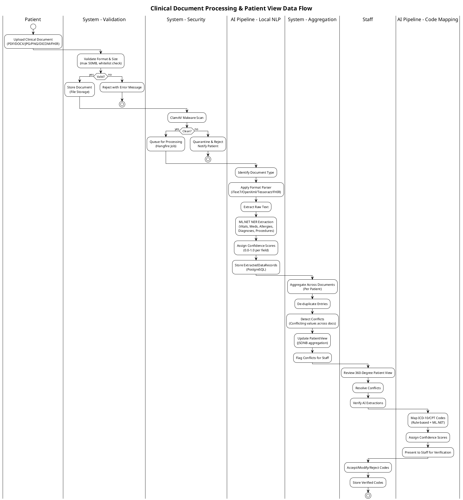
```plantuml
@startuml data-flow
!theme plain
skinparam defaultTextAlignment center

title Clinical Document Processing & Patient View Data Flow

|Patient|
start
:Upload Clinical Document\n(PDF/DOCX/JPG/PNG/DICOM/FHIR);

|System - Validation|
:Validate Format & Size\n(max 50MB, whitelist check);
if (Valid?) then (yes)
    :Store Document\n(File Storage);
else (no)
    :Reject with Error Message;
    stop
endif

|System - Security|
:ClamAV Malware Scan;
if (Clean?) then (yes)
    :Queue for Processing\n(Hangfire Job);
else (no)
    :Quarantine & Reject\nNotify Patient;
    stop
endif

|AI Pipeline - Local NLP|
:Identify Document Type;
:Apply Format Parser\n(iText7/OpenXml/Tesseract/FHIR);
:Extract Raw Text;
:ML.NET NER Extraction\n(Vitals, Meds, Allergies,\nDiagnoses, Procedures);
:Assign Confidence Scores\n(0.0-1.0 per field);
:Store ExtractedDataRecords\n(PostgreSQL);

|System - Aggregation|
:Aggregate Across Documents\n(Per Patient);
:De-duplicate Entries;
:Detect Conflicts\n(Conflicting values across docs);
:Update PatientView\n(JSONB aggregation);
:Flag Conflicts for Staff;

|Staff|
:Review 360-Degree Patient View;
:Resolve Conflicts;
:Verify AI Extractions;

|AI Pipeline - Code Mapping|
:Map ICD-10/CPT Codes\n(Rule-based + ML.NET);
:Assign Confidence Scores;
:Present to Staff for Verification;

|Staff|
:Accept/Modify/Reject Codes;
:Store Verified Codes;
stop

@enduml
```

---

### Logical Data Model (ERD)

<!-- RENDER type="mermaid" src="./uml-models/logical-data-model.png" -->

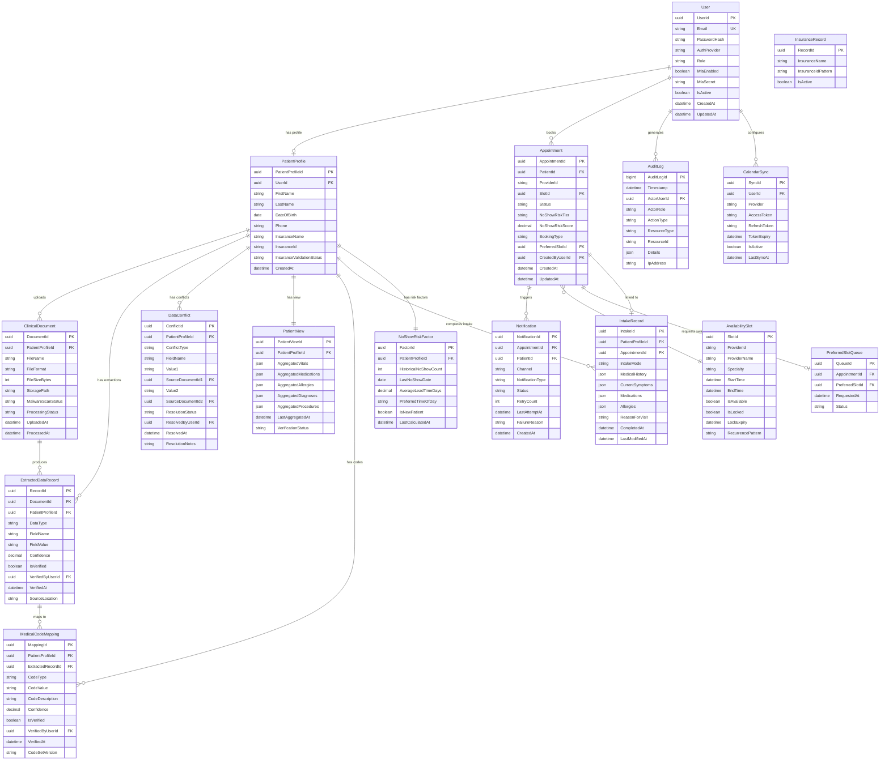
```mermaid
erDiagram
    User {
        uuid UserId PK
        string Email UK
        string PasswordHash
        string AuthProvider
        string Role
        boolean MfaEnabled
        string MfaSecret
        boolean IsActive
        datetime CreatedAt
        datetime UpdatedAt
    }

    PatientProfile {
        uuid PatientProfileId PK
        uuid UserId FK
        string FirstName
        string LastName
        date DateOfBirth
        string Phone
        string InsuranceName
        string InsuranceId
        string InsuranceValidationStatus
        datetime CreatedAt
    }

    Appointment {
        uuid AppointmentId PK
        uuid PatientId FK
        string ProviderId
        uuid SlotId FK
        string Status
        string NoShowRiskTier
        decimal NoShowRiskScore
        string BookingType
        uuid PreferredSlotId FK
        uuid CreatedByUserId FK
        datetime CreatedAt
        datetime UpdatedAt
    }

    AvailabilitySlot {
        uuid SlotId PK
        string ProviderId
        string ProviderName
        string Specialty
        datetime StartTime
        datetime EndTime
        boolean IsAvailable
        boolean IsLocked
        datetime LockExpiry
        string RecurrencePattern
    }

    PreferredSlotQueue {
        uuid QueueId PK
        uuid AppointmentId FK
        uuid PreferredSlotId FK
        datetime RequestedAt
        string Status
    }

    ClinicalDocument {
        uuid DocumentId PK
        uuid PatientProfileId FK
        string FileName
        string FileFormat
        int FileSizeBytes
        string StoragePath
        string MalwareScanStatus
        string ProcessingStatus
        datetime UploadedAt
        datetime ProcessedAt
    }

    ExtractedDataRecord {
        uuid RecordId PK
        uuid DocumentId FK
        uuid PatientProfileId FK
        string DataType
        string FieldName
        string FieldValue
        decimal Confidence
        boolean IsVerified
        uuid VerifiedByUserId FK
        datetime VerifiedAt
        string SourceLocation
    }

    DataConflict {
        uuid ConflictId PK
        uuid PatientProfileId FK
        string ConflictType
        string FieldName
        string Value1
        uuid SourceDocumentId1 FK
        string Value2
        uuid SourceDocumentId2 FK
        string ResolutionStatus
        uuid ResolvedByUserId FK
        datetime ResolvedAt
        string ResolutionNotes
    }

    PatientView {
        uuid PatientViewId PK
        uuid PatientProfileId FK
        json AggregatedVitals
        json AggregatedMedications
        json AggregatedAllergies
        json AggregatedDiagnoses
        json AggregatedProcedures
        datetime LastAggregatedAt
        string VerificationStatus
    }

    MedicalCodeMapping {
        uuid MappingId PK
        uuid PatientProfileId FK
        uuid ExtractedRecordId FK
        string CodeType
        string CodeValue
        string CodeDescription
        decimal Confidence
        boolean IsVerified
        uuid VerifiedByUserId FK
        datetime VerifiedAt
        string CodeSetVersion
    }

    IntakeRecord {
        uuid IntakeId PK
        uuid PatientProfileId FK
        uuid AppointmentId FK
        string IntakeMode
        json MedicalHistory
        json CurrentSymptoms
        json Medications
        json Allergies
        string ReasonForVisit
        datetime CompletedAt
        datetime LastModifiedAt
    }

    Notification {
        uuid NotificationId PK
        uuid AppointmentId FK
        uuid PatientId FK
        string Channel
        string NotificationType
        string Status
        int RetryCount
        datetime LastAttemptAt
        string FailureReason
        datetime CreatedAt
    }

    CalendarSync {
        uuid SyncId PK
        uuid UserId FK
        string Provider
        string AccessToken
        string RefreshToken
        datetime TokenExpiry
        boolean IsActive
        datetime LastSyncAt
    }

    AuditLog {
        bigint AuditLogId PK
        datetime Timestamp
        uuid ActorUserId FK
        string ActorRole
        string ActionType
        string ResourceType
        string ResourceId
        json Details
        string IpAddress
    }

    NoShowRiskFactor {
        uuid FactorId PK
        uuid PatientProfileId FK
        int HistoricalNoShowCount
        date LastNoShowDate
        decimal AverageLeadTimeDays
        string PreferredTimeOfDay
        boolean IsNewPatient
        datetime LastCalculatedAt
    }

    InsuranceRecord {
        uuid RecordId PK
        string InsuranceName
        string InsuranceIdPattern
        boolean IsActive
    }

    User ||--o| PatientProfile : "has profile"
    User ||--o{ Appointment : "books"
    User ||--o{ AuditLog : "generates"
    User ||--o{ CalendarSync : "configures"
    PatientProfile ||--o{ ClinicalDocument : "uploads"
    PatientProfile ||--o{ ExtractedDataRecord : "has extractions"
    PatientProfile ||--o{ DataConflict : "has conflicts"
    PatientProfile ||--|| PatientView : "has view"
    PatientProfile ||--o{ MedicalCodeMapping : "has codes"
    PatientProfile ||--o{ IntakeRecord : "completes intake"
    PatientProfile ||--|| NoShowRiskFactor : "has risk factors"
    Appointment ||--o{ Notification : "triggers"
    Appointment }o--|| AvailabilitySlot : "occupies"
    Appointment ||--o| PreferredSlotQueue : "requests swap"
    Appointment ||--o| IntakeRecord : "linked to"
    ClinicalDocument ||--o{ ExtractedDataRecord : "produces"
    ExtractedDataRecord ||--o{ MedicalCodeMapping : "maps to"
```

---

### AI Architecture Diagrams

#### RAG Pipeline Diagram

<!-- RENDER type="plantuml" src="./uml-models/rag-pipeline.png" -->

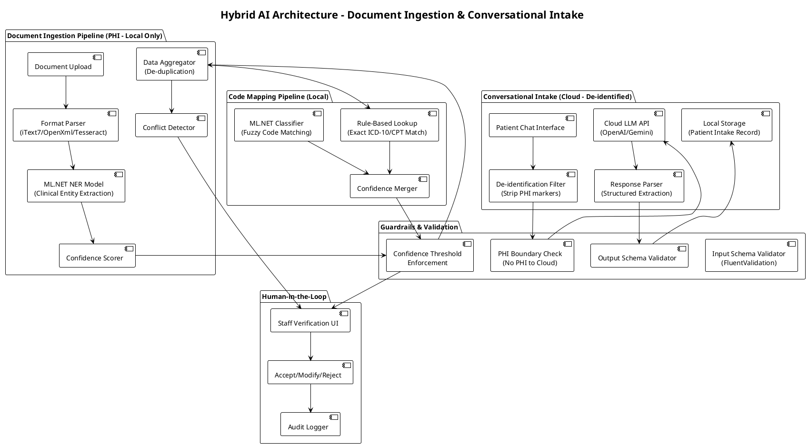
```plantuml
@startuml rag-pipeline
!theme plain
skinparam defaultTextAlignment center

title Hybrid AI Architecture - Document Ingestion & Conversational Intake

package "Document Ingestion Pipeline (PHI - Local Only)" as ingestion {
    [Document Upload] as upload
    [Format Parser\n(iText7/OpenXml/Tesseract)] as parser
    [ML.NET NER Model\n(Clinical Entity Extraction)] as ner
    [Confidence Scorer] as scorer
    [Data Aggregator\n(De-duplication)] as aggregator
    [Conflict Detector] as conflict
}

package "Code Mapping Pipeline (Local)" as coding {
    [Rule-Based Lookup\n(Exact ICD-10/CPT Match)] as rules
    [ML.NET Classifier\n(Fuzzy Code Matching)] as fuzzy
    [Confidence Merger] as merger
}

package "Conversational Intake (Cloud - De-identified)" as intake {
    [Patient Chat Interface] as chat
    [De-identification Filter\n(Strip PHI markers)] as deident
    [Cloud LLM API\n(OpenAI/Gemini)] as llm
    [Response Parser\n(Structured Extraction)] as respparser
    [Local Storage\n(Patient Intake Record)] as intakestore
}

package "Guardrails & Validation" as guardrails {
    [Input Schema Validator\n(FluentValidation)] as inputval
    [Output Schema Validator] as outputval
    [Confidence Threshold\nEnforcement] as threshold
    [PHI Boundary Check\n(No PHI to Cloud)] as phibound
}

package "Human-in-the-Loop" as hitl {
    [Staff Verification UI] as staffui
    [Accept/Modify/Reject] as decision
    [Audit Logger] as auditlog
}

upload --> parser
parser --> ner
ner --> scorer
scorer --> threshold
threshold --> aggregator
aggregator --> conflict
conflict --> staffui

aggregator --> rules
rules --> merger
fuzzy --> merger
merger --> threshold
threshold --> staffui

chat --> deident
deident --> phibound
phibound --> llm
llm --> respparser
respparser --> outputval
outputval --> intakestore

staffui --> decision
decision --> auditlog
@enduml
```

#### AI Sequence Diagram — UC-009 (AI Conversational Intake)

<!-- RENDER type="mermaid" src="./uml-models/ai-seq-uc-009.png" -->

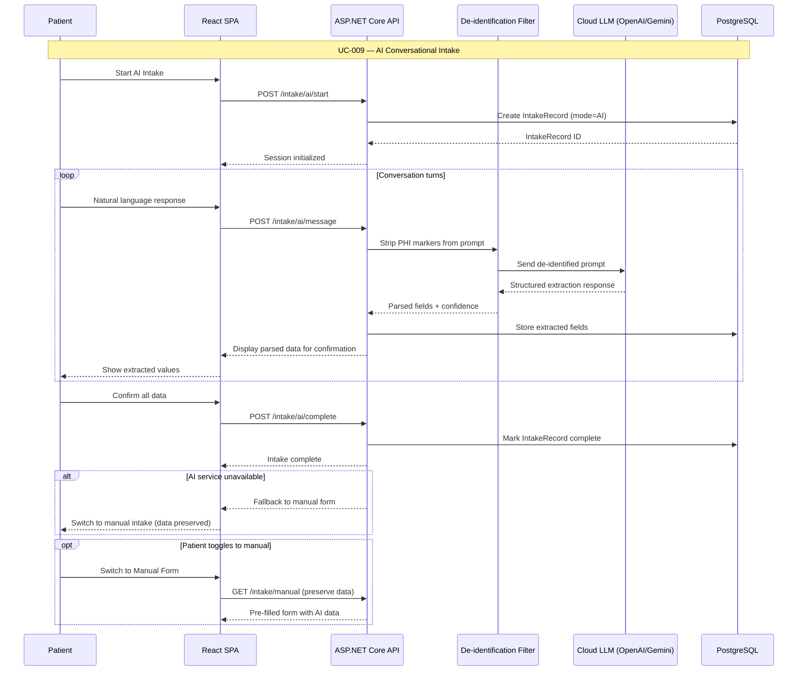
```mermaid
sequenceDiagram
    participant Patient
    participant ReactSPA as React SPA
    participant API as ASP.NET Core API
    participant DeIdent as De-identification Filter
    participant LLM as Cloud LLM (OpenAI/Gemini)
    participant DB as PostgreSQL

    Note over Patient,DB: UC-009 — AI Conversational Intake

    Patient->>ReactSPA: Start AI Intake
    ReactSPA->>API: POST /intake/ai/start
    API->>DB: Create IntakeRecord (mode=AI)
    DB-->>API: IntakeRecord ID
    API-->>ReactSPA: Session initialized

    loop Conversation turns
        Patient->>ReactSPA: Natural language response
        ReactSPA->>API: POST /intake/ai/message
        API->>DeIdent: Strip PHI markers from prompt
        DeIdent->>LLM: Send de-identified prompt
        LLM-->>DeIdent: Structured extraction response
        DeIdent-->>API: Parsed fields + confidence
        API->>DB: Store extracted fields
        API-->>ReactSPA: Display parsed data for confirmation
        ReactSPA-->>Patient: Show extracted values
    end

    Patient->>ReactSPA: Confirm all data
    ReactSPA->>API: POST /intake/ai/complete
    API->>DB: Mark IntakeRecord complete
    API-->>ReactSPA: Intake complete

    alt AI service unavailable
        API-->>ReactSPA: Fallback to manual form
        ReactSPA-->>Patient: Switch to manual intake (data preserved)
    end

    opt Patient toggles to manual
        Patient->>ReactSPA: Switch to Manual Form
        ReactSPA->>API: GET /intake/manual (preserve data)
        API-->>ReactSPA: Pre-filled form with AI data
    end
```

#### AI Sequence Diagram — UC-012 (Clinical Data Extraction)

<!-- RENDER type="mermaid" src="./uml-models/ai-seq-uc-012.png" -->

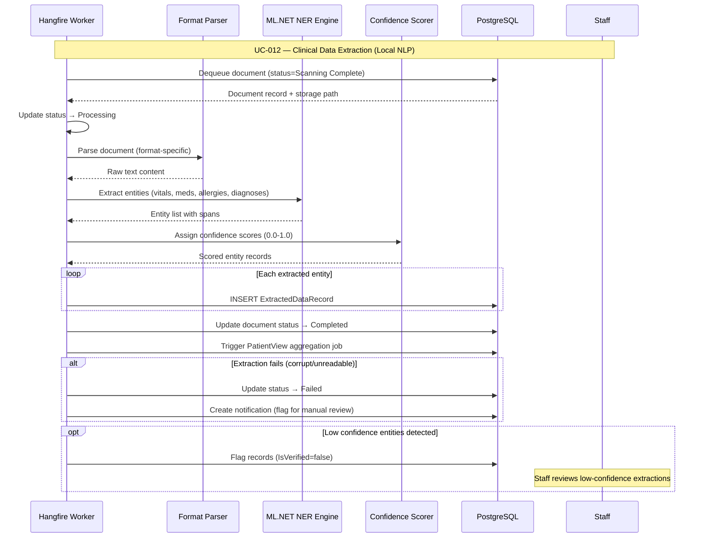
```mermaid
sequenceDiagram
    participant Hangfire as Hangfire Worker
    participant Parser as Format Parser
    participant NER as ML.NET NER Engine
    participant Scorer as Confidence Scorer
    participant DB as PostgreSQL
    participant Staff

    Note over Hangfire,Staff: UC-012 — Clinical Data Extraction (Local NLP)

    Hangfire->>DB: Dequeue document (status=Scanning Complete)
    DB-->>Hangfire: Document record + storage path
    Hangfire->>Hangfire: Update status → Processing

    Hangfire->>Parser: Parse document (format-specific)
    Parser-->>Hangfire: Raw text content

    Hangfire->>NER: Extract entities (vitals, meds, allergies, diagnoses)
    NER-->>Hangfire: Entity list with spans

    Hangfire->>Scorer: Assign confidence scores (0.0-1.0)
    Scorer-->>Hangfire: Scored entity records

    loop Each extracted entity
        Hangfire->>DB: INSERT ExtractedDataRecord
    end

    Hangfire->>DB: Update document status → Completed
    Hangfire->>DB: Trigger PatientView aggregation job

    alt Extraction fails (corrupt/unreadable)
        Hangfire->>DB: Update status → Failed
        Hangfire->>DB: Create notification (flag for manual review)
    end

    opt Low confidence entities detected
        Hangfire->>DB: Flag records (IsVerified=false)
        Note over Staff: Staff reviews low-confidence extractions
    end
```

---

## Use Case Sequence Diagrams

### UC-001: Patient Registration and Login

**Source:** `spec.md#UC-001`

<!-- RENDER type="mermaid" src="./uml-models/seq-uc-001.png" -->

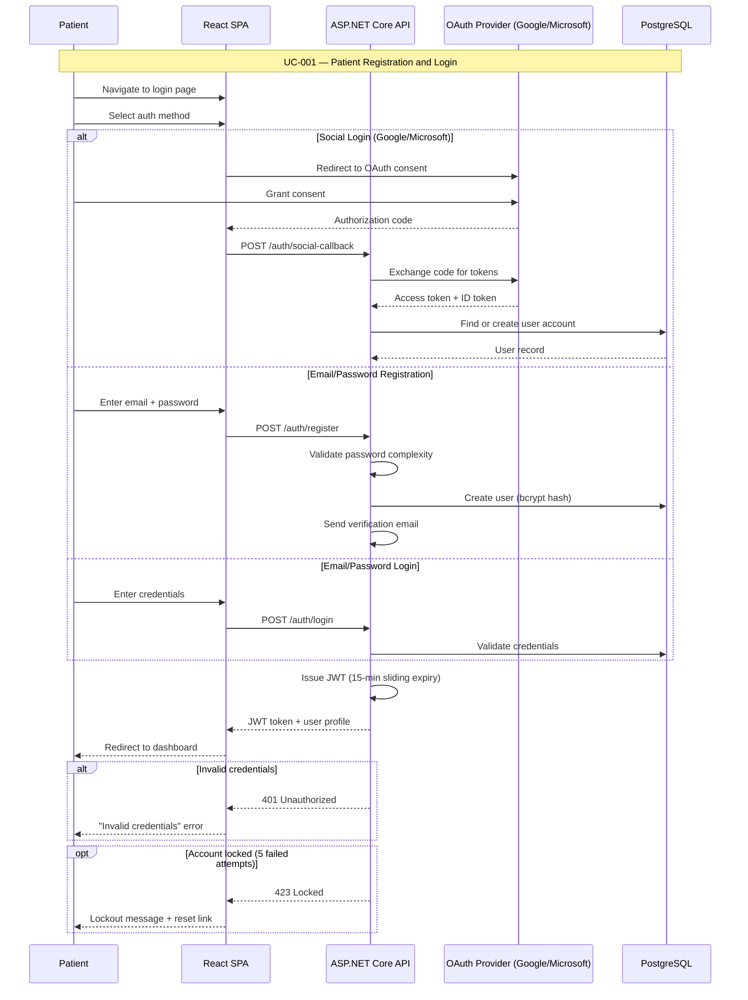
```mermaid
sequenceDiagram
    participant Patient
    participant SPA as React SPA
    participant API as ASP.NET Core API
    participant OAuth as OAuth Provider (Google/Microsoft)
    participant DB as PostgreSQL

    Note over Patient,DB: UC-001 — Patient Registration and Login

    Patient->>SPA: Navigate to login page
    Patient->>SPA: Select auth method

    alt Social Login (Google/Microsoft)
        SPA->>OAuth: Redirect to OAuth consent
        Patient->>OAuth: Grant consent
        OAuth-->>SPA: Authorization code
        SPA->>API: POST /auth/social-callback
        API->>OAuth: Exchange code for tokens
        OAuth-->>API: Access token + ID token
        API->>DB: Find or create user account
        DB-->>API: User record
    else Email/Password Registration
        Patient->>SPA: Enter email + password
        SPA->>API: POST /auth/register
        API->>API: Validate password complexity
        API->>DB: Create user (bcrypt hash)
        API->>API: Send verification email
    else Email/Password Login
        Patient->>SPA: Enter credentials
        SPA->>API: POST /auth/login
        API->>DB: Validate credentials
    end

    API->>API: Issue JWT (15-min sliding expiry)
    API-->>SPA: JWT token + user profile
    SPA-->>Patient: Redirect to dashboard

    alt Invalid credentials
        API-->>SPA: 401 Unauthorized
        SPA-->>Patient: "Invalid credentials" error
    end

    opt Account locked (5 failed attempts)
        API-->>SPA: 423 Locked
        SPA-->>Patient: Lockout message + reset link
    end
```

---

### UC-002: Staff/Admin Authentication with MFA

**Source:** `spec.md#UC-002`

<!-- RENDER type="mermaid" src="./uml-models/seq-uc-002.png" -->

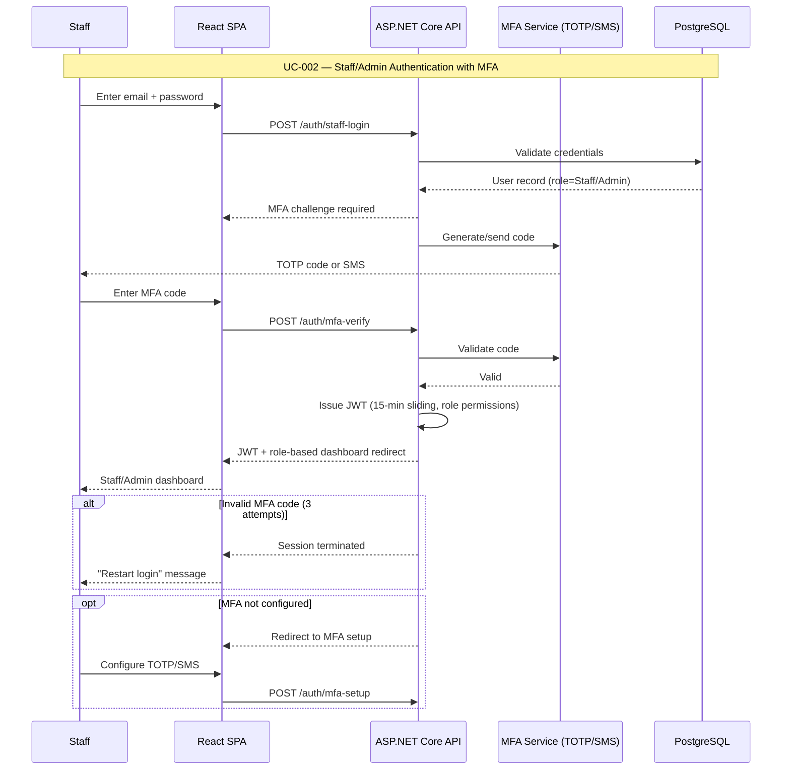
```mermaid
sequenceDiagram
    participant Staff
    participant SPA as React SPA
    participant API as ASP.NET Core API
    participant MFA as MFA Service (TOTP/SMS)
    participant DB as PostgreSQL

    Note over Staff,DB: UC-002 — Staff/Admin Authentication with MFA

    Staff->>SPA: Enter email + password
    SPA->>API: POST /auth/staff-login
    API->>DB: Validate credentials
    DB-->>API: User record (role=Staff/Admin)
    API-->>SPA: MFA challenge required

    API->>MFA: Generate/send code
    MFA-->>Staff: TOTP code or SMS
    Staff->>SPA: Enter MFA code
    SPA->>API: POST /auth/mfa-verify
    API->>MFA: Validate code
    MFA-->>API: Valid

    API->>API: Issue JWT (15-min sliding, role permissions)
    API-->>SPA: JWT + role-based dashboard redirect
    SPA-->>Staff: Staff/Admin dashboard

    alt Invalid MFA code (3 attempts)
        API-->>SPA: Session terminated
        SPA-->>Staff: "Restart login" message
    end

    opt MFA not configured
        API-->>SPA: Redirect to MFA setup
        Staff->>SPA: Configure TOTP/SMS
        SPA->>API: POST /auth/mfa-setup
    end
```

---

### UC-003: Patient Books Appointment

**Source:** `spec.md#UC-003`

<!-- RENDER type="mermaid" src="./uml-models/seq-uc-003.png" -->

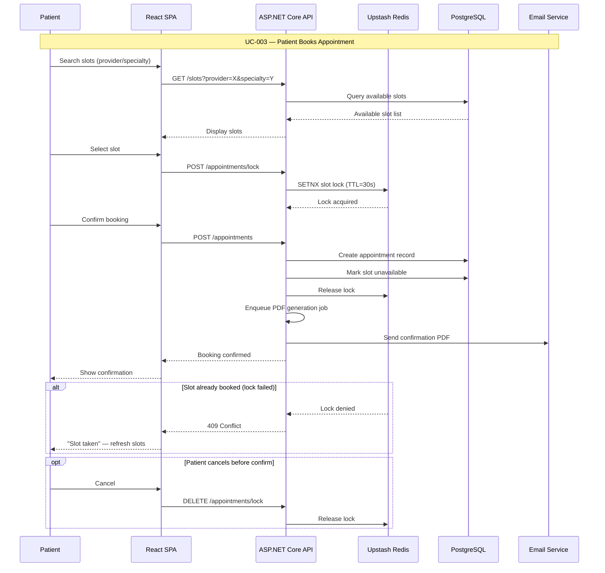
```mermaid
sequenceDiagram
    participant Patient
    participant SPA as React SPA
    participant API as ASP.NET Core API
    participant Redis as Upstash Redis
    participant DB as PostgreSQL
    participant Email as Email Service

    Note over Patient,Email: UC-003 — Patient Books Appointment

    Patient->>SPA: Search slots (provider/specialty)
    SPA->>API: GET /slots?provider=X&specialty=Y
    API->>DB: Query available slots
    DB-->>API: Available slot list
    API-->>SPA: Display slots

    Patient->>SPA: Select slot
    SPA->>API: POST /appointments/lock
    API->>Redis: SETNX slot lock (TTL=30s)
    Redis-->>API: Lock acquired

    Patient->>SPA: Confirm booking
    SPA->>API: POST /appointments
    API->>DB: Create appointment record
    API->>DB: Mark slot unavailable
    API->>Redis: Release lock
    API->>API: Enqueue PDF generation job
    API->>Email: Send confirmation PDF
    API-->>SPA: Booking confirmed
    SPA-->>Patient: Show confirmation

    alt Slot already booked (lock failed)
        Redis-->>API: Lock denied
        API-->>SPA: 409 Conflict
        SPA-->>Patient: "Slot taken" — refresh slots
    end

    opt Patient cancels before confirm
        Patient->>SPA: Cancel
        SPA->>API: DELETE /appointments/lock
        API->>Redis: Release lock
    end
```

---

### UC-004: Preferred Slot Swap

**Source:** `spec.md#UC-004`

<!-- RENDER type="mermaid" src="./uml-models/seq-uc-004.png" -->

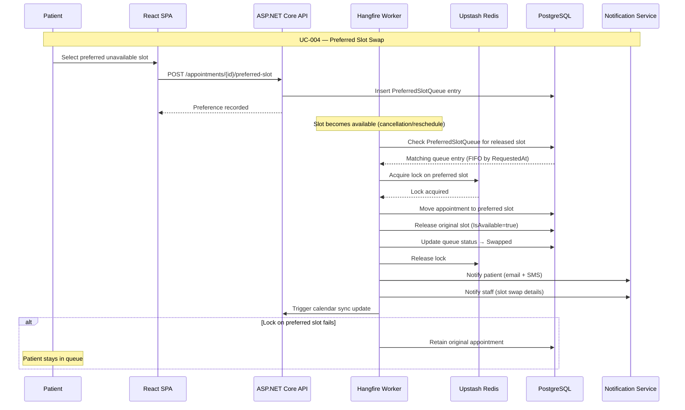
```mermaid
sequenceDiagram
    participant Patient
    participant SPA as React SPA
    participant API as ASP.NET Core API
    participant Hangfire as Hangfire Worker
    participant Redis as Upstash Redis
    participant DB as PostgreSQL
    participant Notify as Notification Service

    Note over Patient,Notify: UC-004 — Preferred Slot Swap

    Patient->>SPA: Select preferred unavailable slot
    SPA->>API: POST /appointments/{id}/preferred-slot
    API->>DB: Insert PreferredSlotQueue entry
    API-->>SPA: Preference recorded

    Note over Hangfire: Slot becomes available (cancellation/reschedule)
    Hangfire->>DB: Check PreferredSlotQueue for released slot
    DB-->>Hangfire: Matching queue entry (FIFO by RequestedAt)

    Hangfire->>Redis: Acquire lock on preferred slot
    Redis-->>Hangfire: Lock acquired
    Hangfire->>DB: Move appointment to preferred slot
    Hangfire->>DB: Release original slot (IsAvailable=true)
    Hangfire->>DB: Update queue status → Swapped
    Hangfire->>Redis: Release lock

    Hangfire->>Notify: Notify patient (email + SMS)
    Hangfire->>Notify: Notify staff (slot swap details)
    Hangfire->>API: Trigger calendar sync update

    alt Lock on preferred slot fails
        Hangfire->>DB: Retain original appointment
        Note over Patient: Patient stays in queue
    end
```

---

### UC-005: Staff Walk-in Booking

**Source:** `spec.md#UC-005`

<!-- RENDER type="mermaid" src="./uml-models/seq-uc-005.png" -->

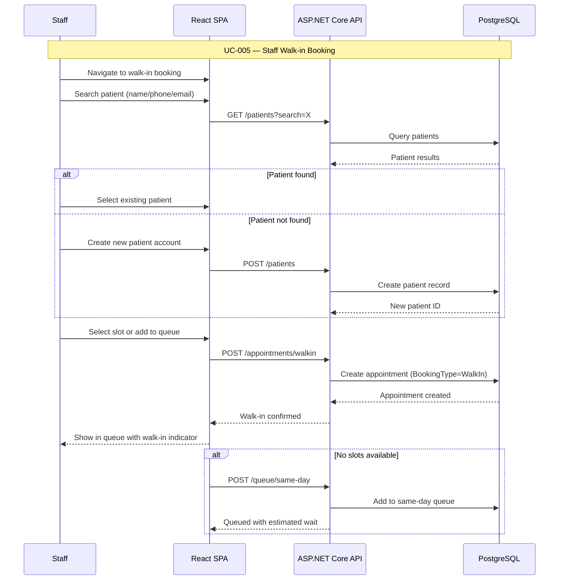
```mermaid
sequenceDiagram
    participant Staff
    participant SPA as React SPA
    participant API as ASP.NET Core API
    participant DB as PostgreSQL

    Note over Staff,DB: UC-005 — Staff Walk-in Booking

    Staff->>SPA: Navigate to walk-in booking
    Staff->>SPA: Search patient (name/phone/email)
    SPA->>API: GET /patients?search=X
    API->>DB: Query patients
    DB-->>API: Patient results

    alt Patient found
        Staff->>SPA: Select existing patient
    else Patient not found
        Staff->>SPA: Create new patient account
        SPA->>API: POST /patients
        API->>DB: Create patient record
        DB-->>API: New patient ID
    end

    Staff->>SPA: Select slot or add to queue
    SPA->>API: POST /appointments/walkin
    API->>DB: Create appointment (BookingType=WalkIn)
    DB-->>API: Appointment created
    API-->>SPA: Walk-in confirmed
    SPA-->>Staff: Show in queue with walk-in indicator

    alt No slots available
        SPA->>API: POST /queue/same-day
        API->>DB: Add to same-day queue
        API-->>SPA: Queued with estimated wait
    end
```

---

### UC-006: Staff Queue Management and Arrival Marking

**Source:** `spec.md#UC-006`

<!-- RENDER type="mermaid" src="./uml-models/seq-uc-006.png" -->

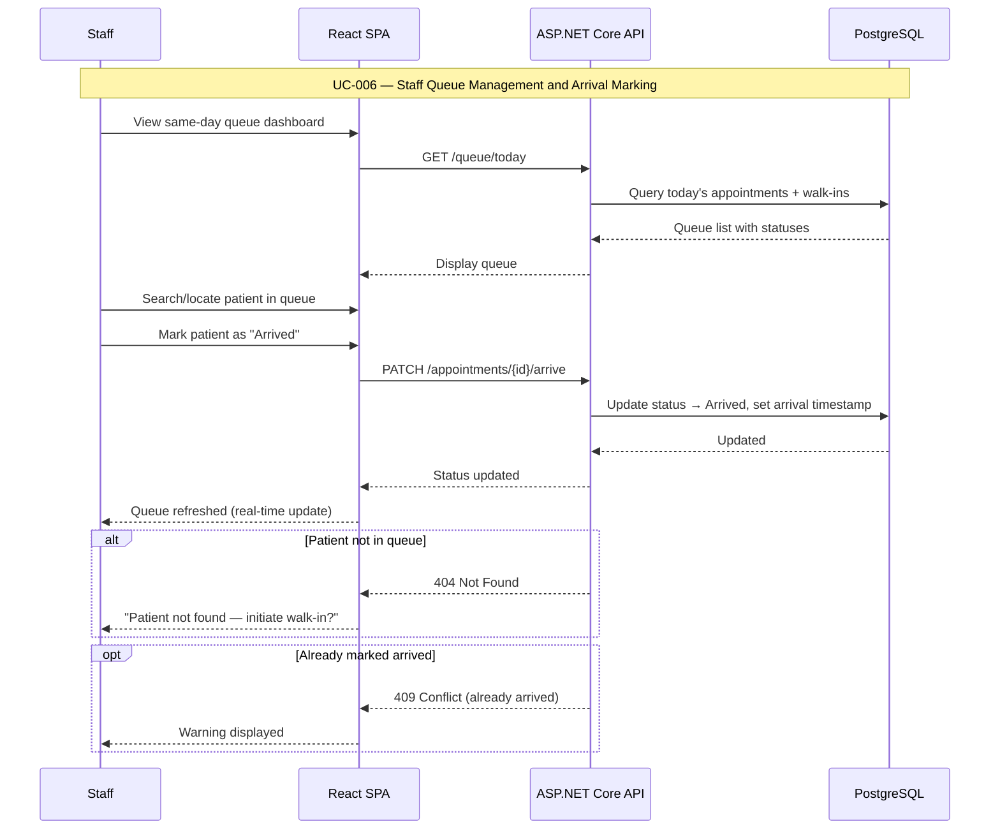
```mermaid
sequenceDiagram
    participant Staff
    participant SPA as React SPA
    participant API as ASP.NET Core API
    participant DB as PostgreSQL

    Note over Staff,DB: UC-006 — Staff Queue Management and Arrival Marking

    Staff->>SPA: View same-day queue dashboard
    SPA->>API: GET /queue/today
    API->>DB: Query today's appointments + walk-ins
    DB-->>API: Queue list with statuses
    API-->>SPA: Display queue

    Staff->>SPA: Search/locate patient in queue
    Staff->>SPA: Mark patient as "Arrived"
    SPA->>API: PATCH /appointments/{id}/arrive
    API->>DB: Update status → Arrived, set arrival timestamp
    DB-->>API: Updated
    API-->>SPA: Status updated
    SPA-->>Staff: Queue refreshed (real-time update)

    alt Patient not in queue
        API-->>SPA: 404 Not Found
        SPA-->>Staff: "Patient not found — initiate walk-in?"
    end

    opt Already marked arrived
        API-->>SPA: 409 Conflict (already arrived)
        SPA-->>Staff: Warning displayed
    end
```

---

### UC-007: Calendar Sync (Google/Outlook)

**Source:** `spec.md#UC-007`

<!-- RENDER type="mermaid" src="./uml-models/seq-uc-007.png" -->

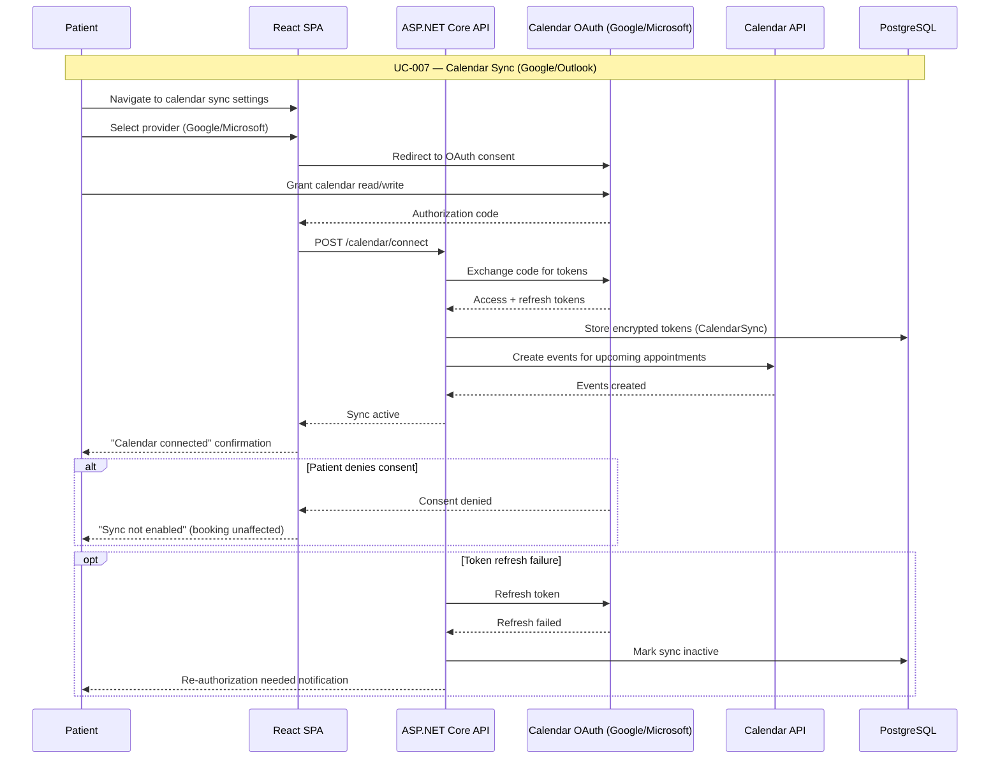
```mermaid
sequenceDiagram
    participant Patient
    participant SPA as React SPA
    participant API as ASP.NET Core API
    participant OAuth as Calendar OAuth (Google/Microsoft)
    participant CalAPI as Calendar API
    participant DB as PostgreSQL

    Note over Patient,DB: UC-007 — Calendar Sync (Google/Outlook)

    Patient->>SPA: Navigate to calendar sync settings
    Patient->>SPA: Select provider (Google/Microsoft)
    SPA->>OAuth: Redirect to OAuth consent
    Patient->>OAuth: Grant calendar read/write
    OAuth-->>SPA: Authorization code
    SPA->>API: POST /calendar/connect
    API->>OAuth: Exchange code for tokens
    OAuth-->>API: Access + refresh tokens
    API->>DB: Store encrypted tokens (CalendarSync)

    API->>CalAPI: Create events for upcoming appointments
    CalAPI-->>API: Events created
    API-->>SPA: Sync active
    SPA-->>Patient: "Calendar connected" confirmation

    alt Patient denies consent
        OAuth-->>SPA: Consent denied
        SPA-->>Patient: "Sync not enabled" (booking unaffected)
    end

    opt Token refresh failure
        API->>OAuth: Refresh token
        OAuth-->>API: Refresh failed
        API->>DB: Mark sync inactive
        API-->>Patient: Re-authorization needed notification
    end
```

---

### UC-008: Appointment Cancellation/Rescheduling

**Source:** `spec.md#UC-008`

<!-- RENDER type="mermaid" src="./uml-models/seq-uc-008.png" -->

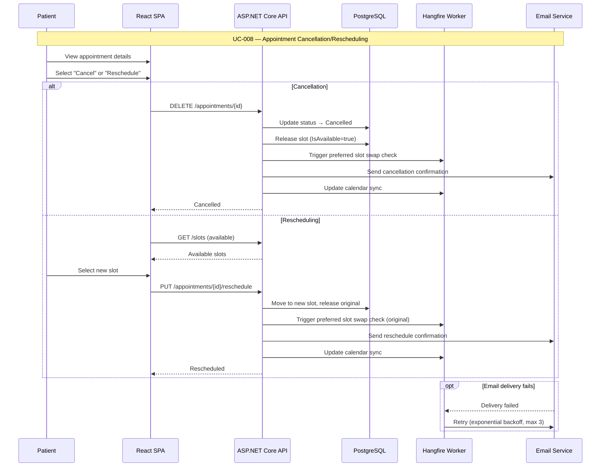
```mermaid
sequenceDiagram
    participant Patient
    participant SPA as React SPA
    participant API as ASP.NET Core API
    participant DB as PostgreSQL
    participant Hangfire as Hangfire Worker
    participant Email as Email Service

    Note over Patient,Email: UC-008 — Appointment Cancellation/Rescheduling

    Patient->>SPA: View appointment details
    Patient->>SPA: Select "Cancel" or "Reschedule"

    alt Cancellation
        SPA->>API: DELETE /appointments/{id}
        API->>DB: Update status → Cancelled
        API->>DB: Release slot (IsAvailable=true)
        API->>Hangfire: Trigger preferred slot swap check
        API->>Email: Send cancellation confirmation
        API->>Hangfire: Update calendar sync
        API-->>SPA: Cancelled
    else Rescheduling
        SPA->>API: GET /slots (available)
        API-->>SPA: Available slots
        Patient->>SPA: Select new slot
        SPA->>API: PUT /appointments/{id}/reschedule
        API->>DB: Move to new slot, release original
        API->>Hangfire: Trigger preferred slot swap check (original)
        API->>Email: Send reschedule confirmation
        API->>Hangfire: Update calendar sync
        API-->>SPA: Rescheduled
    end

    opt Email delivery fails
        Email-->>Hangfire: Delivery failed
        Hangfire->>Email: Retry (exponential backoff, max 3)
    end
```

---

### UC-009: AI Conversational Intake

**Source:** `spec.md#UC-009`

<!-- RENDER type="mermaid" src="./uml-models/seq-uc-009.png" -->

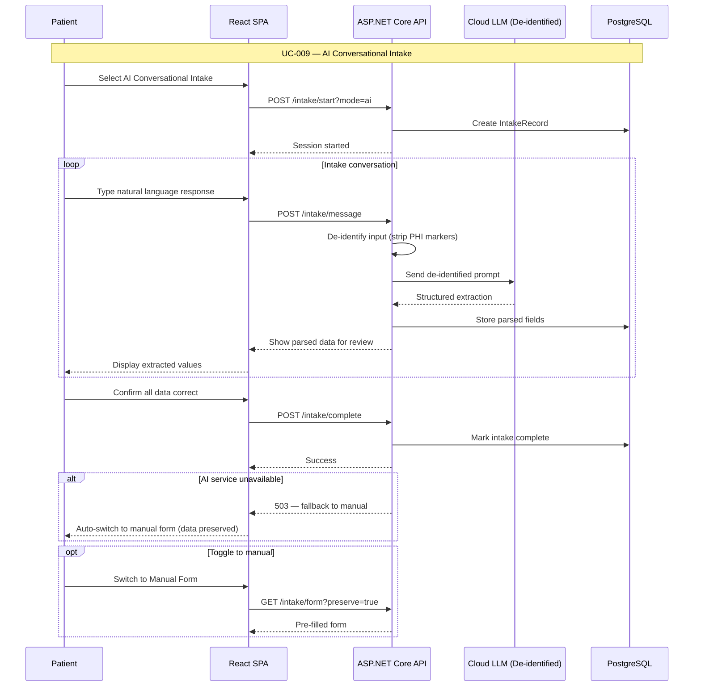
```mermaid
sequenceDiagram
    participant Patient
    participant SPA as React SPA
    participant API as ASP.NET Core API
    participant LLM as Cloud LLM (De-identified)
    participant DB as PostgreSQL

    Note over Patient,DB: UC-009 — AI Conversational Intake

    Patient->>SPA: Select AI Conversational Intake
    SPA->>API: POST /intake/start?mode=ai
    API->>DB: Create IntakeRecord
    API-->>SPA: Session started

    loop Intake conversation
        Patient->>SPA: Type natural language response
        SPA->>API: POST /intake/message
        API->>API: De-identify input (strip PHI markers)
        API->>LLM: Send de-identified prompt
        LLM-->>API: Structured extraction
        API->>DB: Store parsed fields
        API-->>SPA: Show parsed data for review
        SPA-->>Patient: Display extracted values
    end

    Patient->>SPA: Confirm all data correct
    SPA->>API: POST /intake/complete
    API->>DB: Mark intake complete
    API-->>SPA: Success

    alt AI service unavailable
        API-->>SPA: 503 — fallback to manual
        SPA-->>Patient: Auto-switch to manual form (data preserved)
    end

    opt Toggle to manual
        Patient->>SPA: Switch to Manual Form
        SPA->>API: GET /intake/form?preserve=true
        API-->>SPA: Pre-filled form
    end
```

---

### UC-010: Manual Form Intake

**Source:** `spec.md#UC-010`

<!-- RENDER type="mermaid" src="./uml-models/seq-uc-010.png" -->

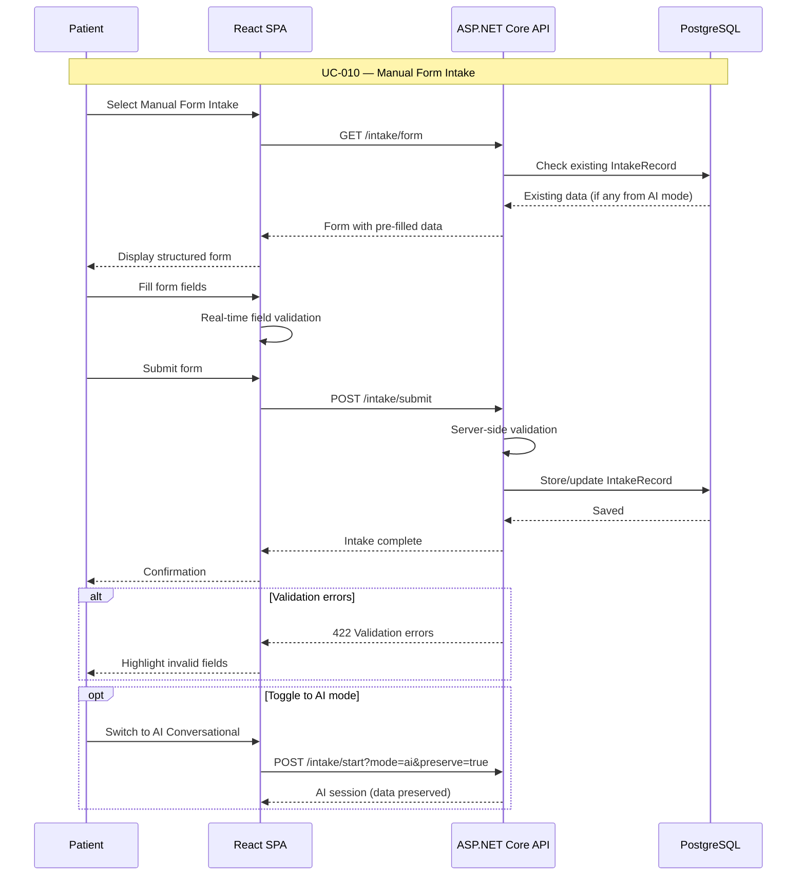
```mermaid
sequenceDiagram
    participant Patient
    participant SPA as React SPA
    participant API as ASP.NET Core API
    participant DB as PostgreSQL

    Note over Patient,DB: UC-010 — Manual Form Intake

    Patient->>SPA: Select Manual Form Intake
    SPA->>API: GET /intake/form
    API->>DB: Check existing IntakeRecord
    DB-->>API: Existing data (if any from AI mode)
    API-->>SPA: Form with pre-filled data
    SPA-->>Patient: Display structured form

    Patient->>SPA: Fill form fields
    SPA->>SPA: Real-time field validation

    Patient->>SPA: Submit form
    SPA->>API: POST /intake/submit
    API->>API: Server-side validation
    API->>DB: Store/update IntakeRecord
    DB-->>API: Saved
    API-->>SPA: Intake complete
    SPA-->>Patient: Confirmation

    alt Validation errors
        API-->>SPA: 422 Validation errors
        SPA-->>Patient: Highlight invalid fields
    end

    opt Toggle to AI mode
        Patient->>SPA: Switch to AI Conversational
        SPA->>API: POST /intake/start?mode=ai&preserve=true
        API-->>SPA: AI session (data preserved)
    end
```

---

### UC-011: Patient Uploads Clinical Documents

**Source:** `spec.md#UC-011`

<!-- RENDER type="mermaid" src="./uml-models/seq-uc-011.png" -->

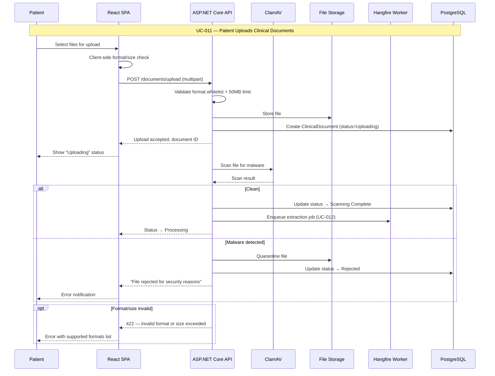
```mermaid
sequenceDiagram
    participant Patient
    participant SPA as React SPA
    participant API as ASP.NET Core API
    participant ClamAV as ClamAV
    participant Storage as File Storage
    participant Hangfire as Hangfire Worker
    participant DB as PostgreSQL

    Note over Patient,DB: UC-011 — Patient Uploads Clinical Documents

    Patient->>SPA: Select files for upload
    SPA->>SPA: Client-side format/size check
    SPA->>API: POST /documents/upload (multipart)
    API->>API: Validate format whitelist + 50MB limit
    API->>Storage: Store file
    API->>DB: Create ClinicalDocument (status=Uploading)
    API-->>SPA: Upload accepted, document ID
    SPA-->>Patient: Show "Uploading" status

    API->>ClamAV: Scan file for malware
    ClamAV-->>API: Scan result

    alt Clean
        API->>DB: Update status → Scanning Complete
        API->>Hangfire: Enqueue extraction job (UC-012)
        API-->>SPA: Status → Processing
    else Malware detected
        API->>Storage: Quarantine file
        API->>DB: Update status → Rejected
        API-->>SPA: "File rejected for security reasons"
        SPA-->>Patient: Error notification
    end

    opt Format/size invalid
        API-->>SPA: 422 — invalid format or size exceeded
        SPA-->>Patient: Error with supported formats list
    end
```

---

### UC-012: Clinical Data Extraction

**Source:** `spec.md#UC-012`

<!-- RENDER type="mermaid" src="./uml-models/seq-uc-012.png" -->

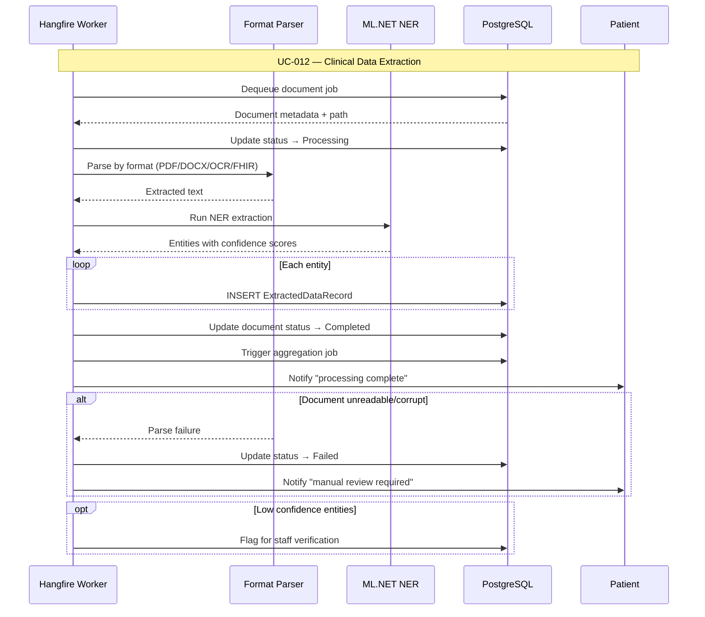
```mermaid
sequenceDiagram
    participant Hangfire as Hangfire Worker
    participant Parser as Format Parser
    participant NER as ML.NET NER
    participant DB as PostgreSQL
    participant Patient

    Note over Hangfire,Patient: UC-012 — Clinical Data Extraction

    Hangfire->>DB: Dequeue document job
    DB-->>Hangfire: Document metadata + path
    Hangfire->>DB: Update status → Processing

    Hangfire->>Parser: Parse by format (PDF/DOCX/OCR/FHIR)
    Parser-->>Hangfire: Extracted text

    Hangfire->>NER: Run NER extraction
    NER-->>Hangfire: Entities with confidence scores

    loop Each entity
        Hangfire->>DB: INSERT ExtractedDataRecord
    end

    Hangfire->>DB: Update document status → Completed
    Hangfire->>DB: Trigger aggregation job
    Hangfire->>Patient: Notify "processing complete"

    alt Document unreadable/corrupt
        Parser-->>Hangfire: Parse failure
        Hangfire->>DB: Update status → Failed
        Hangfire->>Patient: Notify "manual review required"
    end

    opt Low confidence entities
        Hangfire->>DB: Flag for staff verification
    end
```

---

### UC-013: 360-Degree Patient View with Conflict Resolution

**Source:** `spec.md#UC-013`

<!-- RENDER type="mermaid" src="./uml-models/seq-uc-013.png" -->

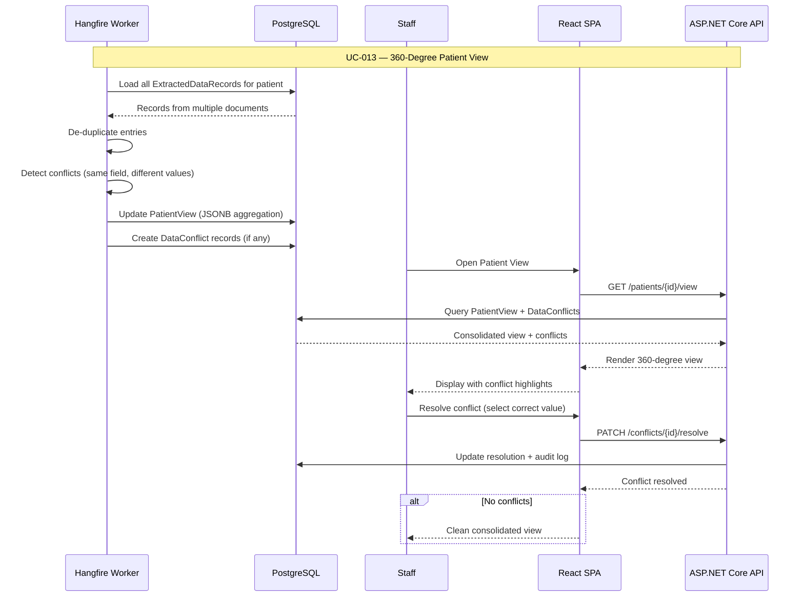
```mermaid
sequenceDiagram
    participant Hangfire as Hangfire Worker
    participant DB as PostgreSQL
    participant Staff
    participant SPA as React SPA
    participant API as ASP.NET Core API

    Note over Hangfire,API: UC-013 — 360-Degree Patient View

    Hangfire->>DB: Load all ExtractedDataRecords for patient
    DB-->>Hangfire: Records from multiple documents
    Hangfire->>Hangfire: De-duplicate entries
    Hangfire->>Hangfire: Detect conflicts (same field, different values)
    Hangfire->>DB: Update PatientView (JSONB aggregation)
    Hangfire->>DB: Create DataConflict records (if any)

    Staff->>SPA: Open Patient View
    SPA->>API: GET /patients/{id}/view
    API->>DB: Query PatientView + DataConflicts
    DB-->>API: Consolidated view + conflicts
    API-->>SPA: Render 360-degree view
    SPA-->>Staff: Display with conflict highlights

    Staff->>SPA: Resolve conflict (select correct value)
    SPA->>API: PATCH /conflicts/{id}/resolve
    API->>DB: Update resolution + audit log
    API-->>SPA: Conflict resolved

    alt No conflicts
        SPA-->>Staff: Clean consolidated view
    end
```

---

### UC-014: ICD-10/CPT Code Mapping

**Source:** `spec.md#UC-014`

<!-- RENDER type="mermaid" src="./uml-models/seq-uc-014.png" -->

```mermaid
sequenceDiagram
    participant Staff
    participant SPA as React SPA
    participant API as ASP.NET Core API
    participant Mapper as Code Mapping Engine
    participant DB as PostgreSQL

    Note over Staff,DB: UC-014 — ICD-10/CPT Code Mapping

    Staff->>SPA: Open code mapping for patient
    SPA->>API: GET /patients/{id}/codes
    API->>Mapper: Analyse aggregated patient data
    Mapper->>Mapper: Rule-based exact match
    Mapper->>Mapper: ML.NET fuzzy match (ambiguous)
    Mapper-->>API: Suggested codes with confidence
    API-->>SPA: Code suggestions list
    SPA-->>Staff: Display codes with confidence indicators

    loop Each suggested code
        Staff->>SPA: Accept / Modify / Reject
        SPA->>API: PATCH /codes/{id}
        API->>DB: Store verified code + audit
    end

    opt Staff adds manual code
        Staff->>SPA: Enter code manually
        SPA->>API: POST /codes/manual
        API->>DB: Store with "Staff Override" source
    end

    alt Low confidence codes
        SPA-->>Staff: Flagged "Manual Review Required"
    end
```

---

### UC-015: Automated Appointment Reminders

**Source:** `spec.md#UC-015`

<!-- RENDER type="mermaid" src="./uml-models/seq-uc-015.png" -->

```mermaid
sequenceDiagram
    participant Hangfire as Hangfire Scheduler
    participant DB as PostgreSQL
    participant SMS as SMS Gateway
    participant Email as Email Service
    participant Staff

    Note over Hangfire,Staff: UC-015 — Automated Appointment Reminders

    Hangfire->>DB: Query appointments approaching reminder time
    DB-->>Hangfire: Appointments with risk tiers

    loop Each appointment
        Hangfire->>DB: Get patient no-show risk tier
        alt Low risk
            Hangfire->>Hangfire: Standard sequence (48h, 2h)
        else Medium/High risk
            Hangfire->>Hangfire: Extended sequence (7d, 48h, 24h, 2h)
        end

        Hangfire->>SMS: Send SMS reminder
        Hangfire->>Email: Send email reminder
        Hangfire->>DB: Record notification (status=Sent)
    end

    alt Delivery failure
        SMS-->>Hangfire: Failed
        Hangfire->>SMS: Retry (exponential backoff)
        Hangfire->>DB: Update retry count

        opt All retries exhausted
            Hangfire->>DB: Status → Failed
            Hangfire->>Staff: Notify permanent failure
        end
    end
```

---

### UC-016: No-Show Risk Scoring

**Source:** `spec.md#UC-016`

<!-- RENDER type="mermaid" src="./uml-models/seq-uc-016.png" -->

```mermaid
sequenceDiagram
    participant API as ASP.NET Core API
    participant Scorer as Risk Scoring Engine
    participant DB as PostgreSQL
    participant Staff
    participant SPA as React SPA

    Note over API,SPA: UC-016 — No-Show Risk Scoring

    API->>API: Appointment created event
    API->>DB: Load NoShowRiskFactor for patient
    DB-->>API: Historical factors (or new patient defaults)

    API->>Scorer: Calculate risk score
    Note right of Scorer: Inputs: no-show count,<br/>lead time, time-of-day,<br/>new-patient flag
    Scorer->>Scorer: Apply weighted algorithm
    Scorer-->>API: Score + tier (Low/Medium/High)

    API->>DB: Store risk tier on appointment
    API->>DB: Update NoShowRiskFactor

    Staff->>SPA: View schedule dashboard
    SPA->>API: GET /schedule/today
    API->>DB: Query appointments with risk tiers
    DB-->>API: Appointments list
    API-->>SPA: Appointments with colour-coded risk
    SPA-->>Staff: Display risk indicators

    alt Missing data (incomplete history)
        Scorer->>Scorer: Use available factors only
        Scorer-->>API: Score (flagged as incomplete)
    end
```

---

### UC-017: Insurance Pre-Check

**Source:** `spec.md#UC-017`

<!-- RENDER type="mermaid" src="./uml-models/seq-uc-017.png" -->

```mermaid
sequenceDiagram
    participant Patient
    participant SPA as React SPA
    participant API as ASP.NET Core API
    participant DB as PostgreSQL

    Note over Patient,DB: UC-017 — Insurance Pre-Check

    Patient->>SPA: Enter insurance name + ID
    SPA->>API: POST /insurance/validate
    API->>DB: Query InsuranceRecord table
    DB-->>API: Match result

    alt Match found
        API-->>SPA: "Insurance Verified" + provider details
        SPA-->>Patient: Green confirmation
    else No match
        API-->>SPA: "Insurance Not Found" (soft check)
        SPA-->>Patient: Warning (does not block booking)
    end

    opt Patient skips insurance
        Patient->>SPA: Skip
        SPA-->>Patient: Proceed to booking (no validation)
    end
```

---

### UC-018: Admin User Management

**Source:** `spec.md#UC-018`

<!-- RENDER type="mermaid" src="./uml-models/seq-uc-018.png" -->

```mermaid
sequenceDiagram
    participant Admin
    participant SPA as React SPA
    participant API as ASP.NET Core API
    participant DB as PostgreSQL
    participant Email as Email Service

    Note over Admin,Email: UC-018 — Admin User Management

    Admin->>SPA: Navigate to user management
    SPA->>API: GET /admin/users
    API->>DB: Query all users
    DB-->>API: User list (roles, status, last login)
    API-->>SPA: Display user table

    alt Create new user
        Admin->>SPA: Enter email, assign role
        SPA->>API: POST /admin/users
        API->>DB: Create user account
        API->>Email: Send activation email
        API-->>SPA: User created
    else Update user
        Admin->>SPA: Change role or details
        SPA->>API: PATCH /admin/users/{id}
        API->>DB: Update user record
        API-->>SPA: Updated (immediate effect)
    else Deactivate user
        Admin->>SPA: Deactivate account
        SPA->>API: DELETE /admin/users/{id}
        API->>DB: Set IsActive=false
        API->>API: Invalidate active sessions
        API-->>SPA: Account deactivated
    end

    opt Last admin protection
        API-->>SPA: 403 — cannot deactivate last admin
        SPA-->>Admin: Error message
    end
```

---

### UC-019: Audit Log Access

**Source:** `spec.md#UC-019`

<!-- RENDER type="mermaid" src="./uml-models/seq-uc-019.png" -->

```mermaid
sequenceDiagram
    participant Admin
    participant SPA as React SPA
    participant API as ASP.NET Core API
    participant DB as PostgreSQL

    Note over Admin,DB: UC-019 — Audit Log Access

    Admin->>SPA: Navigate to audit log viewer
    SPA->>API: GET /admin/audit-logs?page=1
    API->>DB: Query audit logs (newest first, paginated)
    DB-->>API: Log entries + total count
    API-->>SPA: Display log entries

    Admin->>SPA: Apply filters (date, actor, action, resource)
    SPA->>API: GET /admin/audit-logs?filters=...
    API->>DB: Filtered query
    DB-->>API: Filtered results
    API-->>SPA: Updated display

    opt Export
        Admin->>SPA: Export filtered results
        SPA->>API: GET /admin/audit-logs/export
        API->>DB: Stream filtered entries
        API-->>SPA: CSV/JSON download
    end

    alt No results
        API-->>SPA: Empty result set
        SPA-->>Admin: "No entries found" with filter summary
    end

    opt Attempt to modify log
        Note right of DB: UPDATE/DELETE blocked by<br/>database rules (immutable)
    end
```

---

### UC-020: Admin Dashboard Metrics

**Source:** `spec.md#UC-020`

<!-- RENDER type="mermaid" src="./uml-models/seq-uc-020.png" -->

```mermaid
sequenceDiagram
    participant Admin
    participant SPA as React SPA
    participant API as ASP.NET Core API
    participant DB as PostgreSQL

    Note over Admin,DB: UC-020 — Admin Dashboard Metrics

    Admin->>SPA: Navigate to admin dashboard
    SPA->>API: GET /admin/metrics
    API->>DB: Aggregate metrics (patient count, appointments, no-show rate)
    DB-->>API: Current metrics + trends
    API-->>SPA: Metrics payload
    SPA-->>Admin: Display dashboard (cards + charts)

    Admin->>SPA: Select date range filter
    SPA->>API: GET /admin/metrics?from=X&to=Y
    API->>DB: Filtered aggregation
    DB-->>API: Period metrics
    API-->>SPA: Updated dashboard
    SPA-->>Admin: Filtered view

    alt No data (new deployment)
        API-->>SPA: Zero-state response
        SPA-->>Admin: "No data yet" placeholder
    end
```
