# Requirements Specification

## Feature Goal

Build a unified, standalone healthcare platform — the **Unified Patient Access & Clinical Intelligence Platform** — that combines patient-centric appointment scheduling with a "Trust-First" clinical intelligence engine. The platform replaces the current disconnected workflow where scheduling tools lack clinical context and clinical data extraction is a manual, error-prone process.

**Current State:** Healthcare organizations operate fragmented systems — booking tools that do not surface clinical data, and clinical staff manually reading multi-format PDF reports (20+ minutes per patient) to gather vitals, history, and medications. No-show rates reach 15% due to complex booking flows and lack of intelligent reminders. Existing AI coding tools suffer a "Black Box" trust deficit where users must manually verify unlinked data.

**End State:** A single platform where patients book appointments through an intuitive interface with smart slot management, complete intake via AI conversation or manual forms, and upload clinical documents. The system automatically extracts, de-duplicates, and consolidates patient data into a verified 360-Degree Patient View with mapped ICD-10/CPT codes — transforming a 20-minute manual search into a 2-minute verification action. Staff manage walk-ins, queues, and arrivals from a centralized dashboard. All data handling is 100% HIPAA-compliant with immutable audit trails.

## Business Justification

- **Revenue protection through no-show reduction:** Providers lose significant revenue from the 15% no-show rate. The platform's preferred slot swap, history-based no-show risk scoring (Low/Medium/High tiers), and risk-escalated multi-channel reminders directly target this problem, enabling measurable reduction against the baseline.
- **Clinical prep efficiency:** Clinical staff spend 20+ minutes manually reading multi-format reports per patient. The AI-powered clinical intelligence engine automates extraction of vitals, history, and medications from uploaded documents, producing a verified 360-Degree Patient View and reducing prep to a 2-minute verification action — a 90% time savings.
- **Market differentiation:** Existing solutions are fragmented — booking tools lack clinical data context, and AI coding tools face a trust deficit. This platform uniquely combines scheduling with a "Trust-First" clinical intelligence engine that surfaces verified data with conflict highlighting, ICD-10/CPT code mapping, and >98% AI-Human Agreement Rate.
- **Patient experience improvement:** Flexible intake (AI conversational or manual form with seamless toggle), intuitive booking with preferred slot swap, calendar sync (Google/Outlook), and automated appointment PDFs via email create a modern, patient-centric experience that drives adoption.
- **Operational centralization for staff:** Staff gain a single dashboard for walk-in booking, same-day queue management, arrival marking, and pre-visit patient data — eliminating context switching across disconnected tools and reducing administrative burden per appointment.
- **Compliance foundation:** HIPAA-compliant data handling with encryption at rest/in transit, role-based access control, immutable audit logging, and 15-minute session timeout establishes the security baseline required for healthcare operations and future EHR integration readiness.

## Feature Scope

**User-visible behaviour:**

- **Patient Registration & Login:** Patients register and log in via Google/Microsoft social login or email/password. OAuth 2.0 tokens with 15-minute sliding expiry manage sessions.
- **Appointment Booking:** Patients search available slots by provider/specialty, select a slot, and book. The system prevents double-booking via optimistic concurrency. Confirmation is delivered as a PDF via email.
- **Preferred Slot Swap:** Patients book an available slot while selecting a preferred unavailable slot. If the preferred slot opens, the system automatically swaps the appointment and releases the original slot.
- **Patient Intake:** Patients choose between an AI-assisted conversational intake or a traditional manual form at any time. If the AI intake fails, the system auto-falls back to the manual form. Patients can toggle freely between modes and edit responses without requiring staff assistance.
- **Clinical Document Upload:** Patients upload clinical documents (PDF, DOCX, JPG/PNG, DICOM, HL7/FHIR bundles) with a max size of 50MB per file. The system validates format, scans for malware, and provides real-time processing status feedback.
- **360-Degree Patient View:** The system aggregates data from multiple uploaded documents into a de-duplicated patient view, highlighting critical data conflicts (e.g., conflicting medications). AI-extracted data is presented for human verification.
- **ICD-10/CPT Code Mapping:** The system maps ICD-10 and CPT codes from aggregated patient data. Staff verify suggested codes before downstream use.
- **Calendar Sync:** Patients sync appointments with Google Calendar or Microsoft Outlook via free APIs. Sync failures are retried asynchronously (max 3 attempts).
- **Automated Reminders:** Multi-channel reminders (SMS and Email) are sent asynchronously with exponential backoff retry (max 3 attempts). Medium and High no-show risk patients receive additional reminder sequences. Staff are notified on final delivery failure.
- **No-Show Risk Assessment:** History-based scoring using past no-show count, appointment lead time, time-of-day pattern, and new-patient flag. Three tiers: Low, Medium, High.
- **Insurance Pre-Check:** Soft validation of insurance name and ID against an internal predefined set of dummy records.
- **Staff Walk-in Booking:** Staff create walk-in bookings, optionally creating a patient account for post-booking use. Staff manage same-day queues and mark patients as "Arrived."
- **Staff/Admin Authentication:** Email/password login with mandatory MFA (TOTP or SMS code) for staff and admin roles.
- **Admin User Management:** Admins create, update, and deactivate user accounts and assign roles (Patient, Staff, Admin).
- **Audit Logging:** Immutable, append-only audit logging for all patient and staff actions. Admins access a searchable, filterable audit log viewer.
- **Admin Dashboard:** Platform adoption metrics including total patient dashboards created, appointments booked, and no-show rate trends.

**Out of scope (Phase 1):**

- Provider logins or provider-facing actions
- Payment gateway integration (provisioning for future reservation fees only)
- Family member profile features
- Patient self-check-in (mobile, web portal, or QR code)
- Direct, bi-directional EHR integration or full claims submission
- Use of paid cloud infrastructure (e.g., Azure, AWS)

### Success Criteria

- [ ] Demonstrable reduction in baseline no-show rate (15%) measured over first 90 days of operation
- [ ] Clinical prep time reduced from 20+ minutes to under 2 minutes per patient (measured by staff time tracking)
- [ ] AI-Human Agreement Rate of >98% for suggested clinical data and medical codes
- [ ] Platform adoption: measurable volume of patient dashboards created and appointments booked within first quarter
- [ ] Critical Conflicts Identified metric tracks prevented safety risks and claim denials
- [ ] 99.9% platform uptime maintained over rolling 30-day periods
- [ ] Zero HIPAA compliance violations during initial deployment phase

## Functional Requirements

### User Management & Authentication

- FR-001: [DETERMINISTIC] [SOURCE:INPUT] System MUST allow patients to register and log in using Google or Microsoft social login (OAuth 2.0 / OpenID Connect) or email/password credentials
  Basis: BRD specifies patient-facing booking system; elicitation confirmed social + email login for patients
- FR-002: [DETERMINISTIC] [SOURCE:INPUT] System MUST require staff and admin users to authenticate via email/password with mandatory multi-factor authentication (TOTP or SMS code)
  Basis: Elicitation confirmed mandatory MFA for staff/admin roles
- FR-003: [DETERMINISTIC] [SOURCE:INPUT] System MUST issue OAuth 2.0 JWT session tokens with a 15-minute sliding expiry window and automatic session termination upon expiry
  Basis: BRD NFR specifies 15-minute automatic timeout; elicitation confirmed OAuth 2.0 tokens with sliding expiry
- FR-004: [DETERMINISTIC] [SOURCE:INPUT] System MUST enforce role-based access control with three roles — Patient, Staff, Admin — where each role has a defined permission set restricting access to authorized features only
  Basis: BRD specifies strict role-based access control; BRD Section 5 defines Patient, Staff, Admin roles
- FR-005: [DETERMINISTIC] [SOURCE:INPUT] System MUST enforce password complexity requirements (minimum 8 characters, at least one uppercase, one lowercase, one digit, one special character) and store passwords using bcrypt or Argon2 hashing
  Basis: HIPAA Security Rule requires access controls; secure password handling is an implicit prerequisite for email/password authentication

### Appointment Booking & Scheduling

- FR-006: [DETERMINISTIC] [SOURCE:INPUT] System MUST allow patients to search available appointment slots by provider or specialty and book a selected time slot
  Basis: BRD Section 4 specifies appointment booking as core feature
- FR-007: [DETERMINISTIC] [SOURCE:INPUT] System MUST support dynamic preferred slot swap where a patient books an available slot while selecting a preferred unavailable slot; if the preferred slot opens, the system automatically swaps the appointment and releases the original slot
  Basis: BRD Section 4 explicitly describes "Dynamic Preferred Slot Swap" as a core differentiator
- FR-008: [DETERMINISTIC] [SOURCE:INPUT] System MUST allow staff members to create walk-in bookings, optionally creating a patient account for post-booking use; patients MUST NOT be able to create walk-in bookings
  Basis: BRD Section 4 states "Only staff members can handle walk-in bookings (optionally creating an account for post-booking)"
- FR-009: [DETERMINISTIC] [SOURCE:INPUT] System MUST allow staff to manage same-day queues and mark patients as "Arrived"; patients MUST NOT be able to self-check-in via apps or QR codes
  Basis: BRD Section 4 states centralized staff control for arrival marking; BRD out-of-scope explicitly excludes patient self-check-in
- FR-010: [DETERMINISTIC] [SOURCE:INPUT] System MUST prevent double-booking of appointment time slots using optimistic concurrency control, returning a conflict error if two users attempt to book the same slot simultaneously
  Basis: Concurrent booking is an implicit requirement for any scheduling system; race conditions must be prevented to maintain data integrity
- FR-011: [DETERMINISTIC] [SOURCE:INPUT] System MUST synchronize booked appointments with the patient's Google Calendar via Google Calendar API (OAuth consent, event CRUD)
  Basis: BRD Section 5 specifies "Google/Outlook calendar sync via free APIs"
- FR-012: [DETERMINISTIC] [SOURCE:INPUT] System MUST synchronize booked appointments with the patient's Microsoft Outlook calendar via Microsoft Graph API (OAuth consent, event CRUD)
  Basis: BRD Section 5 specifies "Google/Outlook calendar sync via free APIs"
- FR-013: [DETERMINISTIC] [SOURCE:INPUT] System MUST generate a PDF containing appointment details and send it to the patient via email upon successful booking
  Basis: BRD Section 5 states "After booking, appointment details are sent as a PDF via email"
- FR-014: [DETERMINISTIC] [SOURCE:INPUT] System MUST allow patients to cancel or reschedule existing appointments, releasing the original slot back to availability and triggering updated calendar sync and notifications
  Basis: Any booking system implicitly requires cancellation/rescheduling capability; slot release is necessary for preferred swap functionality
- FR-042: [DETERMINISTIC] [SOURCE:INPUT] System MUST display a patient's appointment history (past and upcoming) on the patient dashboard with status indicators (Scheduled, Completed, Cancelled, No-Show)
  Basis: Patients implicitly expect visibility into their appointment history; dashboard is referenced in BRD success criteria for "patient dashboards created"

### Patient Intake

- FR-015: [AI-CANDIDATE] [SOURCE:INPUT] System MUST provide an AI-assisted conversational intake mode that uses natural language processing to collect patient information through a chat-style interface
  Basis: BRD Section 4 specifies "AI-assisted conversational intake" as a core differentiator
- FR-016: [DETERMINISTIC] [SOURCE:INPUT] System MUST provide a traditional manual form intake mode with structured form fields for collecting patient information
  Basis: BRD Section 4 specifies "traditional manual form" as the alternative intake method
- FR-017: [DETERMINISTIC] [SOURCE:INPUT] System MUST allow patients to freely toggle between AI conversational intake and manual form intake at any time during the intake process, preserving all previously entered data across mode switches
  Basis: BRD Section 4 states patients "can freely choose between an AI-assisted conversational intake or a traditional manual form at any time, with edits easily handled without forcing human assistance"
- FR-018: [DETERMINISTIC] [SOURCE:INPUT] System MUST automatically fall back from AI conversational intake to manual form intake if the AI service is unavailable or encounters an error, without losing any data already collected
  Basis: Elicitation confirmed graceful degradation — AI intake fails → auto-fallback to manual form

### Clinical Intelligence & Document Management

- FR-019: [DETERMINISTIC] [SOURCE:INPUT] System MUST allow patients to upload clinical documents in the following formats: PDF, DOCX, JPG, PNG, DICOM, and HL7/FHIR bundles
  Basis: BRD specifies "patient-uploaded historical documents"; elicitation confirmed supported format list including DICOM and HL7/FHIR
- FR-020: [DETERMINISTIC] [SOURCE:INPUT] System MUST validate uploaded files against a maximum size of 50MB per file and reject files that do not match the supported format whitelist, displaying a clear error message
  Basis: Elicitation confirmed max 50MB per file with format whitelist validation
- FR-021: [DETERMINISTIC] [SOURCE:INPUT] System MUST scan all uploaded clinical documents for malware before processing, quarantining and rejecting files that fail the scan with a notification to the patient
  Basis: Accepting file uploads from external users requires malware scanning as a security best practice; HIPAA requires safeguards for electronic PHI
- FR-022: [AI-CANDIDATE] [SOURCE:INPUT] System MUST extract clinical data — including vitals, medical history, current medications, allergies, and diagnoses — from uploaded documents using AI-powered natural language processing and named entity recognition
  Basis: BRD Section 2 states the platform "Ingests patient-uploaded historical documents and post-visit clinical notes to generate a unified, verified 360-Degree Patient View"
- FR-023: [HYBRID] [SOURCE:INPUT] System MUST aggregate extracted data from multiple uploaded documents into a single de-duplicated 360-Degree Patient View, presenting the consolidated data for human verification before clinical use
  Basis: BRD Section 4 specifies "Data Consolidation" and BRD Section 2 describes "unified, verified 360-Degree Patient View"
- FR-024: [HYBRID] [SOURCE:INPUT] System MUST explicitly highlight critical data conflicts across documents — including conflicting medications, allergies, or diagnoses — displaying both conflicting values with their source document references for staff resolution
  Basis: BRD Section 4 explicitly states "explicitly highlighting critical data conflicts (e.g., conflicting medications)"
- FR-025: [HYBRID] [SOURCE:INPUT] System MUST map ICD-10 and CPT codes based on aggregated patient data, presenting suggested codes with confidence indicators for staff verification before any downstream use
  Basis: BRD Section 5 specifies "Mapping of ICD-10 and CPT codes based on aggregated patient data"
- FR-026: [DETERMINISTIC] [SOURCE:INPUT] System MUST display real-time processing status for each uploaded document (Uploading, Scanning, Processing, Completed, Failed) with progress indicators visible to the patient
  Basis: Patients implicitly expect feedback on async document processing; status tracking is necessary for graceful degradation per elicitation decisions
- FR-027: [DETERMINISTIC] [SOURCE:INPUT] System MUST retain uploaded clinical documents indefinitely until the patient explicitly requests deletion, at which point all associated data and extracted records MUST be permanently removed
  Basis: Elicitation confirmed indefinite retention until patient requests deletion

### Notifications & Reminders

- FR-028: [DETERMINISTIC] [SOURCE:INPUT] System MUST send automated appointment reminders via both SMS and email channels at configurable intervals before the appointment time
  Basis: BRD Section 5 specifies "automated multi-channel reminders (SMS/Email)"
- FR-029: [DETERMINISTIC] [SOURCE:INPUT] System MUST deliver all external notifications (SMS, email, calendar sync) asynchronously with exponential backoff retry on failure, with a maximum of 3 retry attempts per notification
  Basis: Elicitation confirmed async with exponential backoff retry (max 3 attempts)
- FR-030: [DETERMINISTIC] [SOURCE:INPUT] System MUST send additional reminder sequences to patients classified as Medium or High no-show risk, increasing reminder frequency compared to Low-risk patients
  Basis: Elicitation confirmed Medium and High tiers trigger additional reminder sequences
- FR-031: [DETERMINISTIC] [SOURCE:INPUT] System MUST notify relevant staff members when a preferred slot swap is executed, including the patient name, original slot, and new slot details
  Basis: Staff need awareness when appointments are automatically rescheduled to maintain operational visibility; swap execution changes the day's schedule
- FR-032: [DETERMINISTIC] [SOURCE:INPUT] System MUST notify staff when a notification delivery permanently fails after exhausting all retry attempts, including the patient name, notification type, and failure reason
  Basis: Elicitation confirmed staff notified on final delivery failure

### No-Show Risk Assessment

- FR-033: [HYBRID] [SOURCE:INPUT] System MUST calculate a no-show risk score for each appointment based on: patient's historical no-show count, appointment lead time (bookings >7 days out receive higher risk), time-of-day pattern (early AM and late PM receive higher risk), and new-patient flag
  Basis: Elicitation confirmed history-based scoring with these four specific factors
- FR-034: [DETERMINISTIC] [SOURCE:INPUT] System MUST classify each appointment's no-show risk into one of three tiers — Low, Medium, or High — based on the calculated risk score, and display the risk tier on staff-facing schedule and queue views
  Basis: Elicitation confirmed three-tier classification with staff visibility

### Insurance Validation

- FR-035: [DETERMINISTIC] [SOURCE:INPUT] System MUST perform soft validation of patient-provided insurance name and insurance ID against an internal predefined set of dummy insurance records, returning a match/no-match result without blocking the booking flow
  Basis: BRD Section 5 specifies "Soft validation of insurance name and ID against an internal predefined set of dummy records"

### Administration & Audit

- FR-036: [DETERMINISTIC] [SOURCE:INPUT] System MUST allow admin users to create, update, and deactivate user accounts and assign roles (Patient, Staff, Admin) through an admin interface
  Basis: BRD Section 5 defines Admin role as "user management"
- FR-037: [DETERMINISTIC] [SOURCE:INPUT] System MUST maintain an immutable, append-only audit log recording all patient data access events, staff actions, and system state changes with timestamp, actor ID, action type, and affected resource
  Basis: BRD NFR specifies "immutable audit logging for all patient and staff actions"
- FR-038: [DETERMINISTIC] [SOURCE:INPUT] System MUST provide admin users with a searchable, filterable audit log viewer that supports filtering by date range, actor, action type, and affected resource
  Basis: BRD NFR specifies audit logging; searchable access is implicit for log usability
- FR-039: [DETERMINISTIC] [SOURCE:INPUT] System MUST display an admin dashboard showing platform adoption metrics: total patient dashboards created, total appointments booked, current no-show rate, and trend data
  Basis: BRD success criteria specify "High volume of total patient dashboards created, and appointments successfully booked" as measurable KPIs

### Security & Compliance

- FR-040: [DETERMINISTIC] [SOURCE:INPUT] System MUST encrypt all patient data (PHI) at rest using AES-256 encryption and in transit using TLS 1.2 or higher
  Basis: BRD NFR specifies "100% HIPAA-compliant data handling, transmission, and storage"
- FR-041: [DETERMINISTIC] [SOURCE:INPUT] System MUST enforce API rate limiting on all public-facing endpoints to prevent brute-force attacks and abuse, returning HTTP 429 responses when limits are exceeded
  Basis: OWASP security best practices require rate limiting on authentication and public endpoints; HIPAA requires safeguards against unauthorized access

## Use Case Analysis

### Actors & System Boundary

- **Patient (Primary Actor):** End user who registers, books appointments, completes intake forms, uploads clinical documents, and views the 360-Degree Patient View. Interacts via web browser (mobile-first responsive design).
- **Staff (Secondary Actor):** Front desk or call center personnel who manage walk-in bookings, same-day queues, mark patients as "Arrived", view no-show risk indicators, and verify AI-extracted clinical data and suggested codes.
- **Admin (Secondary Actor):** System administrator who manages user accounts, assigns roles, reviews audit logs, and monitors platform adoption metrics.
- **Google Calendar API (System Actor):** External service for bidirectional appointment sync via OAuth 2.0 consent and Calendar event CRUD operations.
- **Microsoft Graph API (System Actor):** External service for bidirectional Outlook calendar sync via OAuth 2.0 consent and event CRUD operations.
- **SMS Gateway (System Actor):** External service for sending appointment reminder and notification SMS messages asynchronously.
- **Email Service (System Actor):** External SMTP or transactional email service for sending appointment confirmations, PDFs, reminders, and system notifications.
- **Clinical Intelligence Engine (System Actor):** Internal AI-powered processing pipeline that performs NLP/NER extraction on uploaded clinical documents, aggregates data, and maps ICD-10/CPT codes.

### System Context Diagram

<!-- RENDER type="plantuml" src="./uml-models/system-context.png" -->


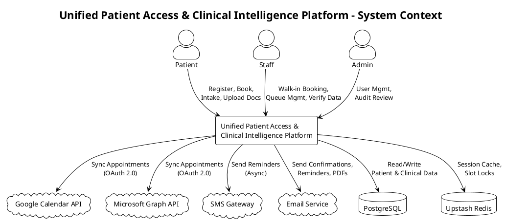

### Use Case Specifications

#### UC-001: Patient Registration and Login

- **Actor(s)**: Patient, Google Calendar API, Microsoft Graph API
- **Parent Requirements**: FR-001, FR-003, FR-005, FR-040
- **Goal**: Patient creates an account or logs in to access the platform
- **Preconditions**: Platform is accessible; patient has a valid email address or Google/Microsoft account
- **Success Scenario**:
  1. Patient navigates to the registration/login page
  2. Patient selects authentication method (Google social login, Microsoft social login, or email/password)
  3. For social login: system redirects to OAuth provider, patient grants consent, system receives tokens and creates/links account
  4. For email/password registration: patient enters email, creates password meeting complexity requirements, confirms email via verification link
  5. For email/password login: patient enters credentials, system validates against stored hash
  6. System issues a JWT session token with 15-minute sliding expiry
  7. Patient is redirected to the patient dashboard
- **Extensions/Alternatives**:
  - 2a. Patient selects social login but denies OAuth consent → system displays error, offers email/password alternative
  - 4a. Password does not meet complexity requirements → system displays specific validation errors, patient corrects
  - 4b. Email already registered → system prompts patient to log in or reset password
  - 5a. Invalid credentials → system increments failed attempt counter, displays generic "invalid credentials" error
  - 5b. Account locked after 5 consecutive failed attempts → system displays lockout message with reset instructions
  - 6a. Session token expired during use → system redirects to login page with "session expired" message
- **Postconditions**: Patient has an active session; account exists in the system with Patient role assigned

##### Use Case Diagram

<!-- RENDER type="plantuml" src="./uml-models/uc-patient-registration.png" -->


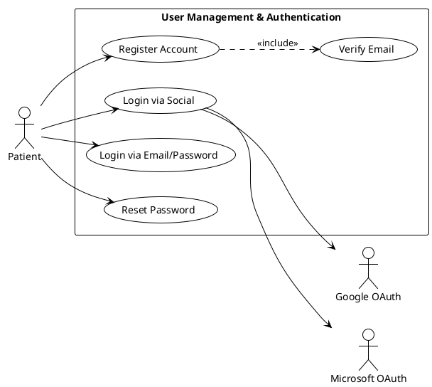

#### UC-002: Staff/Admin Authentication with MFA

- **Actor(s)**: Staff, Admin
- **Parent Requirements**: FR-002, FR-003, FR-004, FR-040
- **Goal**: Staff or admin user authenticates with email/password and completes mandatory MFA to access the platform
- **Preconditions**: User has an active staff or admin account created by an admin
- **Success Scenario**:
  1. Staff/admin navigates to the login page
  2. Staff/admin enters email and password
  3. System validates credentials against stored hash
  4. System prompts for MFA verification (TOTP code or SMS code)
  5. Staff/admin enters MFA code
  6. System validates MFA code
  7. System issues a JWT session token with 15-minute sliding expiry and role-appropriate permissions
  8. Staff/admin is redirected to the role-appropriate dashboard
- **Extensions/Alternatives**:
  - 3a. Invalid credentials → system displays generic "invalid credentials" error, increments failed attempt counter
  - 3b. Account locked after 5 consecutive failed attempts → system displays lockout message, admin must unlock
  - 5a. MFA code expired → system prompts to request a new code
  - 5b. MFA code invalid after 3 attempts → session is terminated, user must restart login
  - 6a. MFA device not configured → system redirects to MFA setup flow
  - 7a. Account deactivated by admin → system rejects login with "account disabled" message
- **Postconditions**: Staff/admin has an active session with role-based permissions enforced

##### Use Case Diagram

<!-- RENDER type="plantuml" src="./uml-models/uc-staff-auth.png" -->


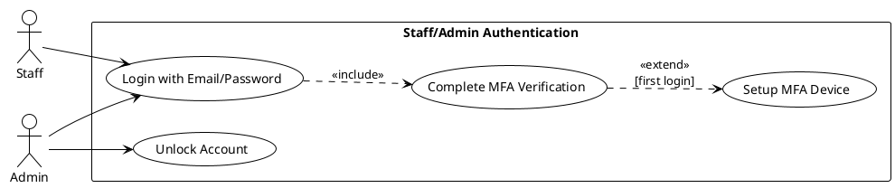

#### UC-003: Patient Books Appointment

- **Actor(s)**: Patient, Email Service
- **Parent Requirements**: FR-006, FR-010, FR-013, FR-042
- **Goal**: Patient searches for and books an available appointment slot
- **Preconditions**: Patient is logged in; at least one appointment slot is available
- **Success Scenario**:
  1. Patient navigates to the appointment booking page
  2. Patient searches for slots by provider or specialty
  3. System displays available time slots
  4. Patient selects a time slot
  5. System acquires a temporary lock on the slot (optimistic concurrency)
  6. Patient confirms the booking
  7. System creates the appointment record, releases the lock, and marks the slot as booked
  8. System generates an appointment confirmation PDF
  9. System sends the PDF to the patient via email
  10. System displays the appointment on the patient dashboard with "Scheduled" status
- **Extensions/Alternatives**:
  - 3a. No slots available for selected criteria → system displays "no slots available" message, suggests alternative dates/providers
  - 5a. Slot was booked by another user between selection and lock attempt → system displays conflict error, refreshes available slots
  - 6a. Patient cancels before confirming → system releases the slot lock, returns to slot selection
  - 8a. PDF generation fails → system logs error, appointment is still created, patient receives text-only email confirmation
  - 9a. Email delivery fails → system queues for retry (max 3 attempts with exponential backoff), logs failure
- **Postconditions**: Appointment is created and visible on patient dashboard; confirmation PDF sent via email; slot is no longer available to other users

##### Use Case Diagram

<!-- RENDER type="plantuml" src="./uml-models/uc-book-appointment.png" -->


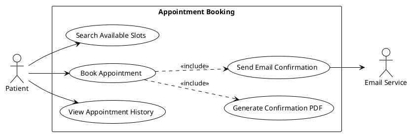

#### UC-004: Preferred Slot Swap

- **Actor(s)**: Patient, Staff (notified), Email Service, SMS Gateway
- **Parent Requirements**: FR-007, FR-031
- **Goal**: Patient indicates a preferred unavailable slot and the system automatically swaps when that slot becomes available
- **Preconditions**: Patient has a confirmed appointment; patient has selected a preferred slot that is currently unavailable
- **Success Scenario**:
  1. During or after booking, patient selects a preferred time slot that is currently unavailable
  2. System records the preferred slot preference linked to the patient's confirmed appointment
  3. When the preferred slot becomes available (via cancellation or rescheduling by another patient), the system detects the match
  4. System acquires a lock on the preferred slot
  5. System moves the patient's appointment to the preferred slot
  6. System releases the patient's original slot back to availability
  7. System sends notification to the patient (email and SMS) confirming the swap
  8. System notifies relevant staff of the swap with patient name, original slot, and new slot
  9. System updates calendar sync if previously configured
- **Extensions/Alternatives**:
  - 3a. Multiple patients have the same preferred slot → system processes by booking timestamp (first-come-first-served)
  - 4a. Preferred slot is taken by another booking before lock is acquired → system retains original appointment, patient remains in preferred slot queue
  - 7a. Patient notification fails → retry with exponential backoff (max 3 attempts)
  - 9a. Calendar sync fails → queue for retry (max 3 attempts), log failure
- **Postconditions**: Patient's appointment is moved to the preferred slot; original slot is released; patient, staff, and calendar are updated

##### Use Case Diagram

<!-- RENDER type="plantuml" src="./uml-models/uc-slot-swap.png" -->


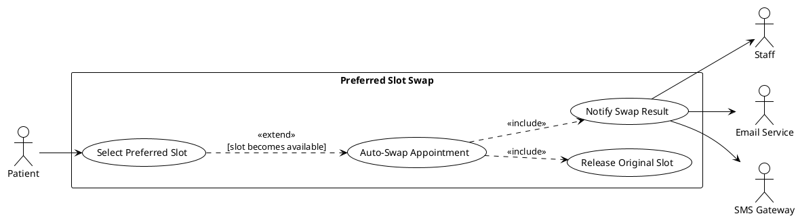

#### UC-005: Staff Walk-in Booking

- **Actor(s)**: Staff
- **Parent Requirements**: FR-008
- **Goal**: Staff creates an appointment for a walk-in patient, optionally creating a patient account
- **Preconditions**: Staff is logged in with Staff role; walk-in patient is physically present
- **Success Scenario**:
  1. Staff navigates to the walk-in booking interface
  2. Staff searches for existing patient by name, phone, or email
  3. If patient exists: staff selects the patient record
  4. If patient does not exist: staff optionally creates a new patient account with basic demographics
  5. Staff selects an available time slot or adds to same-day queue
  6. System creates the walk-in appointment record
  7. System displays the appointment on the staff queue with walk-in indicator
- **Extensions/Alternatives**:
  - 2a. Multiple patient matches found → staff reviews and selects the correct record
  - 4a. Staff chooses not to create an account → appointment is created as a guest walk-in with minimal demographic data
  - 5a. No slots available → staff adds patient to same-day queue with estimated wait time
  - 6a. Appointment creation fails (database error) → system displays error, staff retries
- **Postconditions**: Walk-in appointment is created; patient appears in the staff queue; patient account is created if staff opted in

##### Use Case Diagram

<!-- RENDER type="plantuml" src="./uml-models/uc-walkin-booking.png" -->


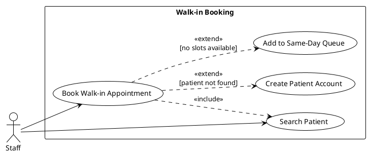

#### UC-006: Staff Queue Management and Arrival Marking

- **Actor(s)**: Staff
- **Parent Requirements**: FR-009
- **Goal**: Staff manages the same-day appointment queue and marks patients as "Arrived" when they check in at the front desk
- **Preconditions**: Staff is logged in; same-day appointments or walk-ins exist in the queue
- **Success Scenario**:
  1. Staff views the same-day queue dashboard showing all scheduled and walk-in patients
  2. Patient arrives and identifies themselves to staff
  3. Staff locates the patient in the queue (search or scroll)
  4. Staff marks the patient as "Arrived"
  5. System updates the appointment status to "Arrived" with arrival timestamp
  6. System displays the updated queue with the patient's status change reflected in real-time
- **Extensions/Alternatives**:
  - 2a. Patient not found in queue → staff verifies appointment details; if no appointment exists, initiates walk-in booking (UC-005)
  - 4a. Patient already marked as "Arrived" → system displays warning, no duplicate action
  - 4b. Appointment is cancelled → system prevents arrival marking, displays "cancelled" status
  - 6a. Queue display fails to update → staff refreshes the page manually
- **Postconditions**: Patient status is "Arrived" in the system; arrival timestamp is recorded; queue reflects current state

##### Use Case Diagram

<!-- RENDER type="plantuml" src="./uml-models/uc-queue-management.png" -->


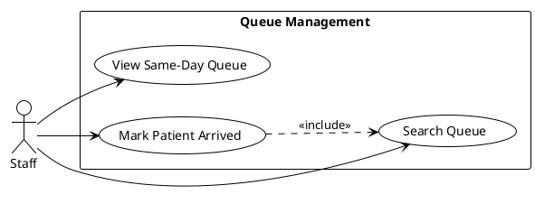

#### UC-007: Calendar Sync (Google/Outlook)

- **Actor(s)**: Patient, Google Calendar API, Microsoft Graph API
- **Parent Requirements**: FR-011, FR-012
- **Goal**: Patient connects their external calendar and appointments are automatically synchronized
- **Preconditions**: Patient is logged in; patient has a Google or Microsoft account
- **Success Scenario**:
  1. Patient navigates to calendar sync settings
  2. Patient selects calendar provider (Google or Microsoft)
  3. System redirects to the OAuth consent screen of the selected provider
  4. Patient grants calendar read/write permissions
  5. System stores the OAuth tokens securely
  6. System creates calendar events for all existing upcoming appointments
  7. System confirms sync is active; future bookings, cancellations, and swaps automatically update the external calendar
- **Extensions/Alternatives**:
  - 4a. Patient denies consent → system returns to settings with "sync not enabled" message; booking flow is not affected
  - 5a. Token storage fails → system displays error, prompts retry
  - 6a. Calendar event creation fails for some appointments → system logs failures, retries asynchronously (max 3 attempts)
  - 7a. OAuth token expires → system uses refresh token; if refresh fails, notifies patient to re-authorize
- **Postconditions**: External calendar contains events for all upcoming appointments; future changes auto-sync

##### Use Case Diagram

<!-- RENDER type="plantuml" src="./uml-models/uc-calendar-sync.png" -->


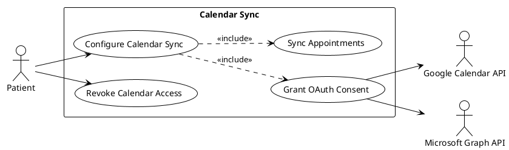

#### UC-008: Appointment Cancellation/Rescheduling

- **Actor(s)**: Patient, Email Service, SMS Gateway
- **Parent Requirements**: FR-014
- **Goal**: Patient cancels or reschedules an existing appointment
- **Preconditions**: Patient is logged in; patient has at least one upcoming appointment with "Scheduled" status
- **Success Scenario (Cancellation)**:
  1. Patient navigates to appointment details on the dashboard
  2. Patient selects "Cancel Appointment"
  3. System prompts for cancellation confirmation
  4. Patient confirms cancellation
  5. System updates appointment status to "Cancelled"
  6. System releases the time slot back to availability
  7. System triggers preferred slot swap check for any patients waiting for that slot (UC-004)
  8. System sends cancellation confirmation to the patient via email
  9. System updates external calendar if sync is configured
- **Success Scenario (Rescheduling)**:
  1. Patient navigates to appointment details on the dashboard
  2. Patient selects "Reschedule"
  3. System displays available time slots (same as UC-003 step 2-3)
  4. Patient selects a new time slot
  5. System acquires lock on new slot, moves appointment, releases original slot
  6. System triggers preferred slot swap check for the released slot (UC-004)
  7. System sends rescheduling confirmation with new details via email
  8. System updates external calendar if sync is configured
- **Extensions/Alternatives**:
  - 4a. Patient cancels the cancellation → no changes made, returns to dashboard
  - 5a. (Reschedule) New slot is taken before lock acquired → conflict error, refresh available slots
  - 8a. Email delivery fails → retry with exponential backoff (max 3 attempts)
  - 9a. Calendar sync fails → queue for retry (max 3 attempts)
- **Postconditions**: Appointment is cancelled or moved to new slot; original slot is released; notifications and calendar are updated

##### Use Case Diagram

<!-- RENDER type="plantuml" src="./uml-models/uc-cancel-reschedule.png" -->


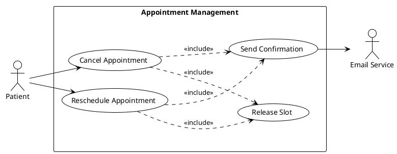

#### UC-009: AI Conversational Intake

- **Actor(s)**: Patient, Clinical Intelligence Engine
- **Parent Requirements**: FR-015, FR-017, FR-018
- **Goal**: Patient completes intake using an AI-assisted conversational interface
- **Preconditions**: Patient is logged in; patient has an upcoming appointment; AI intake service is available
- **Success Scenario**:
  1. Patient navigates to the intake section for their upcoming appointment
  2. Patient selects "AI Conversational Intake" mode (or it is presented as default)
  3. System initiates a conversational interface
  4. AI asks structured questions about medical history, current symptoms, medications, allergies, and reason for visit
  5. Patient responds in natural language
  6. AI extracts structured data from patient responses and displays parsed results for confirmation
  7. Patient reviews extracted data and confirms or corrects
  8. System stores the confirmed intake data linked to the appointment
  9. Patient may toggle to manual form at any time (UC-010), with all data preserved
- **Extensions/Alternatives**:
  - 3a. AI service is unavailable → system automatically falls back to manual form intake (UC-010) with notification to patient
  - 5a. AI cannot parse response → AI requests clarification with a rephrased question
  - 5b. AI confidence below threshold for a field → field is flagged for manual review, patient is prompted to clarify or switch to manual entry for that field
  - 7a. Patient corrects extracted data → AI updates the structured record
  - 9a. Data is preserved during mode switch — no re-entry required
- **Postconditions**: Intake data is stored and linked to the appointment; data is available for clinical prep

##### Use Case Diagram

<!-- RENDER type="plantuml" src="./uml-models/uc-ai-intake.png" -->


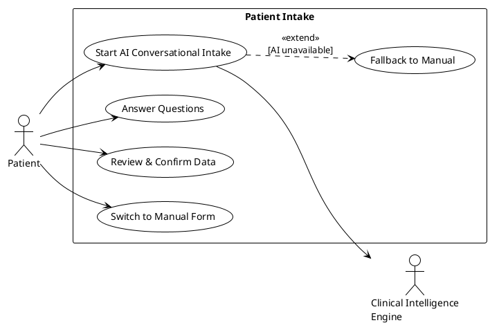

#### UC-010: Manual Form Intake

- **Actor(s)**: Patient
- **Parent Requirements**: FR-016, FR-017
- **Goal**: Patient completes intake using a traditional structured form
- **Preconditions**: Patient is logged in; patient has an upcoming appointment
- **Success Scenario**:
  1. Patient navigates to the intake section for their upcoming appointment
  2. Patient selects "Manual Form" mode (or arrives here via AI fallback)
  3. System displays structured form with fields for medical history, current symptoms, medications, allergies, and reason for visit
  4. Patient fills in form fields
  5. System validates each field in real-time (required fields, format validation)
  6. Patient submits the completed form
  7. System stores the intake data linked to the appointment
  8. Patient may toggle to AI conversational mode at any time (UC-009), with all data preserved
- **Extensions/Alternatives**:
  - 5a. Required field is empty → system highlights the field with validation error, prevents submission
  - 5b. Field format is invalid (e.g., date format) → system displays inline error with expected format
  - 6a. Form submission fails (network/server error) → system preserves entered data locally, displays retry option
  - 8a. Data is preserved during mode switch — no re-entry required
- **Postconditions**: Intake data is stored and linked to the appointment; data is available for clinical prep

##### Use Case Diagram

<!-- RENDER type="plantuml" src="./uml-models/uc-manual-intake.png" -->


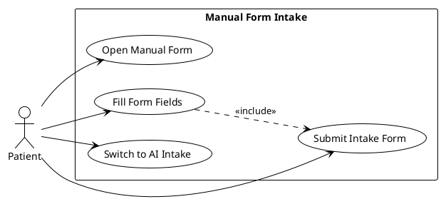

#### UC-011: Patient Uploads Clinical Documents

- **Actor(s)**: Patient
- **Parent Requirements**: FR-019, FR-020, FR-021, FR-027
- **Goal**: Patient uploads clinical documents for data extraction and 360-Degree Patient View generation
- **Preconditions**: Patient is logged in; patient has an active account
- **Success Scenario**:
  1. Patient navigates to the document upload section
  2. Patient selects one or more files from their device
  3. System validates file format against the supported whitelist (PDF, DOCX, JPG, PNG, DICOM, HL7/FHIR)
  4. System validates file size (max 50MB per file)
  5. System uploads the file and displays upload progress
  6. System scans the uploaded file for malware
  7. Malware scan passes — system queues the document for clinical data extraction (UC-012)
  8. System displays document status as "Processing" with real-time progress updates
  9. Patient can view all uploaded documents with their current processing status
- **Extensions/Alternatives**:
  - 3a. File format not supported → system rejects the file with a clear error listing supported formats
  - 4a. File exceeds 50MB → system rejects the file with size limit error
  - 6a. Malware detected → system quarantines the file, rejects it, notifies the patient with "file rejected for security reasons" message
  - 6b. Malware scan service unavailable → system queues file for retry, displays "pending scan" status
  - 7a. Document extraction fails → system marks document as "Failed", notifies patient, flags for manual review
- **Postconditions**: Document is stored securely; malware scan is complete; document is queued for extraction or rejected

##### Use Case Diagram

<!-- RENDER type="plantuml" src="./uml-models/uc-document-upload.png" -->


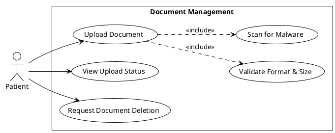

#### UC-012: Clinical Data Extraction

- **Actor(s)**: Clinical Intelligence Engine
- **Parent Requirements**: FR-022, FR-026
- **Goal**: System extracts structured clinical data from uploaded documents using AI
- **Preconditions**: Document has passed malware scan; document is in the extraction queue
- **Success Scenario**:
  1. Clinical Intelligence Engine receives a document from the extraction queue
  2. Engine identifies the document type and applies appropriate parsing strategy
  3. Engine performs NLP/NER extraction to identify vitals, medical history, medications, allergies, and diagnoses
  4. Engine generates a structured data record with confidence scores for each extracted field
  5. Engine stores the extracted data linked to the source document and patient record
  6. System updates the document status to "Completed"
  7. System notifies the patient that document processing is complete
- **Extensions/Alternatives**:
  - 2a. Document format is corrupted or unreadable → system marks document as "Failed", notifies patient, flags for manual review
  - 3a. Engine cannot extract any meaningful data → system marks document as "Extraction Failed — Manual Review Required"
  - 4a. Confidence score below threshold for specific fields → fields are flagged as "Low Confidence" for staff review
  - 5a. Extracted data conflicts with existing patient data → conflict is flagged for resolution in UC-013
- **Postconditions**: Extracted data is stored; document status is updated; data is available for 360-Degree Patient View aggregation

##### Use Case Diagram

<!-- RENDER type="plantuml" src="./uml-models/uc-data-extraction.png" -->


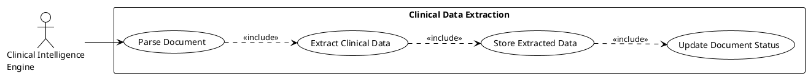

#### UC-013: 360-Degree Patient View with Conflict Resolution

- **Actor(s)**: Staff, Clinical Intelligence Engine
- **Parent Requirements**: FR-023, FR-024
- **Goal**: System aggregates extracted clinical data into a unified, de-duplicated patient view and surfaces conflicts for staff resolution
- **Preconditions**: At least one clinical document has been successfully processed for the patient
- **Success Scenario**:
  1. System aggregates extracted data from all processed documents for the patient
  2. System de-duplicates entries (e.g., same medication from multiple documents)
  3. System detects data conflicts (e.g., Document A lists "Lisinopril 10mg" while Document B lists "Lisinopril 20mg")
  4. System generates the 360-Degree Patient View with consolidated data
  5. System highlights all detected conflicts with both values and source document references
  6. Staff reviews the consolidated view
  7. Staff resolves each conflict by selecting the correct value or entering a corrected value
  8. System updates the patient record with resolved data
- **Extensions/Alternatives**:
  - 3a. No conflicts detected → system displays the consolidated view without conflict highlights
  - 5a. More than two documents contain conflicting values for the same field → system displays all conflicting values with their respective sources
  - 7a. Staff cannot resolve a conflict → staff marks it as "Pending Clinical Review" for provider attention
  - 7b. Staff resolves incorrectly → audit log captures the change; staff or admin can review and correct later
- **Postconditions**: Unified patient view is available; conflicts are resolved or flagged; all resolutions are audit-logged

##### Use Case Diagram

<!-- RENDER type="plantuml" src="./uml-models/uc-patient-view.png" -->


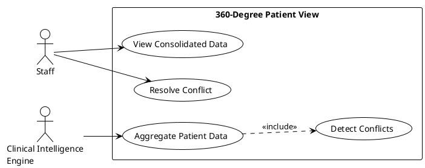

#### UC-014: ICD-10/CPT Code Mapping

- **Actor(s)**: Staff, Clinical Intelligence Engine
- **Parent Requirements**: FR-025
- **Goal**: System maps ICD-10 and CPT codes from aggregated patient data for staff verification
- **Preconditions**: 360-Degree Patient View exists for the patient; extracted clinical data is available
- **Success Scenario**:
  1. System analyses the aggregated patient data (diagnoses, procedures, symptoms)
  2. Clinical Intelligence Engine maps relevant ICD-10 codes based on diagnoses and conditions
  3. Clinical Intelligence Engine maps relevant CPT codes based on procedures and services
  4. System presents suggested codes with confidence indicators and source data references
  5. Staff reviews each suggested code
  6. Staff accepts, modifies, or rejects each code
  7. System stores the verified codes linked to the patient record
- **Extensions/Alternatives**:
  - 2a. No matching ICD-10 codes found → system displays "No codes suggested" with the data that was analysed
  - 4a. Confidence indicator is below threshold → code is flagged with "Low Confidence — Manual Review Required"
  - 6a. Staff rejects a code → code is removed from the suggestion list; rejection is audit-logged
  - 6b. Staff adds a code not suggested by AI → manually entered code is stored with "Staff Override" source tag
- **Postconditions**: Verified ICD-10 and CPT codes are stored; AI-Human Agreement Rate is trackable

##### Use Case Diagram

<!-- RENDER type="plantuml" src="./uml-models/uc-code-mapping.png" -->


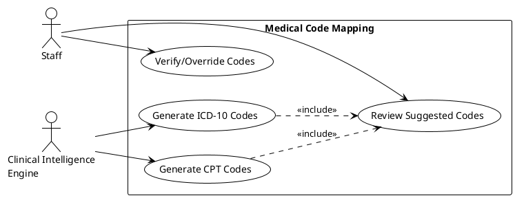

#### UC-015: Automated Appointment Reminders

- **Actor(s)**: Patient, SMS Gateway, Email Service
- **Parent Requirements**: FR-028, FR-029, FR-030, FR-032
- **Goal**: System sends automated multi-channel reminders for upcoming appointments with risk-based escalation
- **Preconditions**: Patient has an upcoming appointment with "Scheduled" status; notification channels (SMS, email) are configured
- **Success Scenario**:
  1. System identifies appointments approaching reminder trigger times
  2. System retrieves the patient's no-show risk tier (Low, Medium, or High)
  3. For Low-risk patients: system sends standard reminder sequence (e.g., 48 hours and 2 hours before)
  4. For Medium/High-risk patients: system sends additional reminders (e.g., 7 days, 48 hours, 24 hours, and 2 hours before)
  5. System sends each reminder via both SMS and email channels asynchronously
  6. System records delivery status for each notification
- **Extensions/Alternatives**:
  - 5a. SMS delivery fails → system retries with exponential backoff (max 3 attempts)
  - 5b. Email delivery fails → system retries with exponential backoff (max 3 attempts)
  - 5c. Both channels fail after all retries → system notifies staff with patient name, notification type, and failure reason
  - 6a. Patient cancels appointment between reminders → system cancels remaining scheduled reminders
- **Postconditions**: Reminders are delivered or failure is escalated to staff; delivery status is recorded

##### Use Case Diagram

<!-- RENDER type="plantuml" src="./uml-models/uc-reminders.png" -->


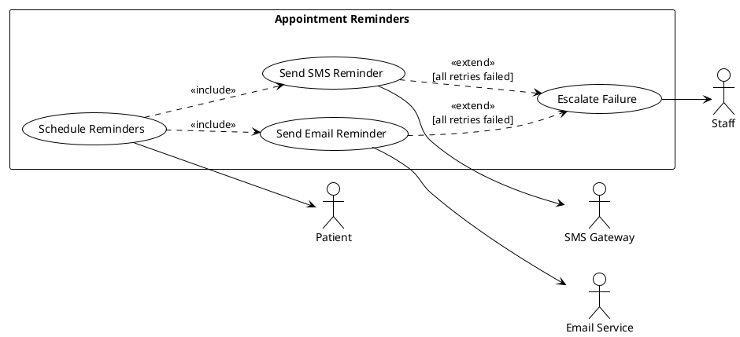

#### UC-016: No-Show Risk Scoring

- **Actor(s)**: Staff (views), Clinical Intelligence Engine (calculates)
- **Parent Requirements**: FR-033, FR-034, FR-030
- **Goal**: System calculates a no-show risk score for each appointment and displays the tier to staff
- **Preconditions**: An appointment is created; patient history data is available (or patient is new)
- **Success Scenario**:
  1. Upon appointment creation, system evaluates no-show risk factors: patient's historical no-show count, appointment lead time, time-of-day pattern, and new-patient flag
  2. System calculates a weighted risk score from these factors
  3. System classifies the score into a tier: Low, Medium, or High
  4. System stores the risk tier linked to the appointment
  5. Staff views the risk tier on the schedule and queue dashboards with visual indicators (colour-coded)
  6. System triggers appropriate reminder sequences based on the tier (UC-015)
- **Extensions/Alternatives**:
  - 1a. Patient has no history (new patient) → new-patient flag contributes to higher risk baseline
  - 2a. Risk factors have missing data → system uses available factors only, logs incomplete assessment
  - 3a. Score falls on tier boundary → system applies the higher-risk tier (conservative approach)
- **Postconditions**: Appointment has an assigned risk tier; tier is visible to staff; reminder scheduling reflects the tier

##### Use Case Diagram

<!-- RENDER type="plantuml" src="./uml-models/uc-noshow-risk.png" -->


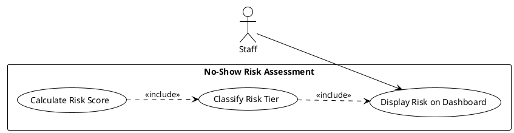

#### UC-017: Insurance Pre-Check

- **Actor(s)**: Patient
- **Parent Requirements**: FR-035
- **Goal**: System performs soft validation of patient-provided insurance information against internal dummy records
- **Preconditions**: Patient is logged in; patient is in the booking or intake flow
- **Success Scenario**:
  1. Patient enters insurance provider name and insurance ID
  2. System searches the internal predefined set of dummy insurance records
  3. System finds a matching record
  4. System displays "Insurance Verified" confirmation with matched provider details
  5. System stores the insurance information linked to the patient record
- **Extensions/Alternatives**:
  - 3a. No matching record found → system displays "Insurance Not Found" with a note that this is a soft check and does not block the booking
  - 1a. Patient skips insurance entry → system allows booking to proceed without insurance validation
  - 2a. Insurance validation service unavailable → system logs error, allows booking to proceed, flags for later validation
- **Postconditions**: Insurance validation result is stored; booking flow is not blocked regardless of validation outcome

##### Use Case Diagram

<!-- RENDER type="plantuml" src="./uml-models/uc-insurance-check.png" -->


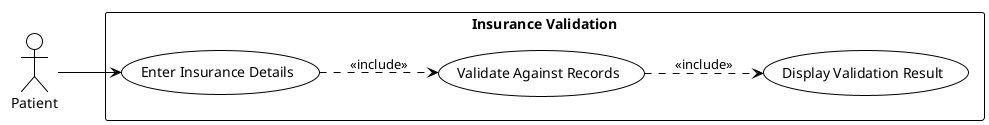

#### UC-018: Admin User Management

- **Actor(s)**: Admin
- **Parent Requirements**: FR-036
- **Goal**: Admin manages user accounts and role assignments
- **Preconditions**: Admin is logged in with Admin role
- **Success Scenario**:
  1. Admin navigates to the user management interface
  2. Admin views a list of all users with their roles, status, and last login
  3. Admin creates a new user account (enters email, assigns role)
  4. System sends account activation email to the new user
  5. Admin updates an existing user's role or account details
  6. System applies the role change immediately (next request uses new permissions)
- **Extensions/Alternatives**:
  - 3a. Email already exists → system displays "account already exists" error
  - 5a. Admin attempts to deactivate the last admin account → system prevents action with "at least one admin required" error
  - 5b. Admin deactivates a staff account with active sessions → system invalidates all active sessions for that user
  - 4a. Activation email fails → system queues for retry (max 3 attempts), displays status to admin
- **Postconditions**: User account is created, updated, or deactivated; role permissions are enforced immediately

##### Use Case Diagram

<!-- RENDER type="plantuml" src="./uml-models/uc-user-management.png" -->


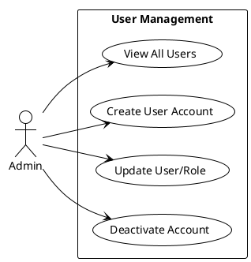

#### UC-019: Audit Log Access

- **Actor(s)**: Admin
- **Parent Requirements**: FR-037, FR-038
- **Goal**: Admin reviews the immutable audit log to track system actions and ensure compliance
- **Preconditions**: Admin is logged in with Admin role; audit log contains entries
- **Success Scenario**:
  1. Admin navigates to the audit log viewer
  2. System displays recent audit log entries (paginated, newest first)
  3. Admin applies filters (date range, actor, action type, affected resource)
  4. System returns filtered results
  5. Admin reviews log entries showing timestamp, actor ID, action type, and affected resource
  6. Admin exports filtered results if needed
- **Extensions/Alternatives**:
  - 3a. No results match filter criteria → system displays "no entries found" with applied filter summary
  - 4a. Large result set → system paginates results, displays total count
  - 5a. Admin attempts to modify or delete audit entries → system prevents action (immutable log)
- **Postconditions**: Admin has reviewed audit data; no log entries have been modified

##### Use Case Diagram

<!-- RENDER type="plantuml" src="./uml-models/uc-audit-log.png" -->


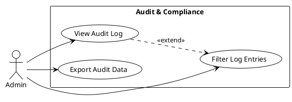

#### UC-020: Admin Dashboard Metrics

- **Actor(s)**: Admin
- **Parent Requirements**: FR-039
- **Goal**: Admin views platform adoption and performance metrics
- **Preconditions**: Admin is logged in with Admin role
- **Success Scenario**:
  1. Admin navigates to the admin dashboard
  2. System displays key metrics: total patient dashboards created, total appointments booked, current no-show rate, and trend data over time
  3. Admin selects a date range to filter metrics
  4. System updates displayed metrics for the selected range
  5. Admin identifies trends (e.g., improving no-show rate, growing adoption)
- **Extensions/Alternatives**:
  - 2a. No data available (new deployment) → system displays zero-state with "no data yet" message
  - 4a. Date range returns no data → system displays empty state for that range
- **Postconditions**: Admin has reviewed platform metrics; no data has been modified

##### Use Case Diagram

<!-- RENDER type="plantuml" src="./uml-models/uc-admin-dashboard.png" -->


```plantuml
@startuml uc-admin-dashboard
!theme plain
left to right direction

actor "Admin" as admin

rectangle "Admin Dashboard" {
  usecase "View Platform Metrics" as UC20_VIEW
  usecase "Filter by Date Range" as UC20_FILTER
  usecase "View Trend Data" as UC20_TRENDS
}

admin --> UC20_VIEW
admin --> UC20_FILTER
UC20_VIEW ..> UC20_TRENDS : <<include>>
UC20_VIEW ..> UC20_FILTER : <<extend>>
@enduml
```

## Risks & Mitigations

- **AI extraction accuracy below 98% target**: Clinical Intelligence Engine may produce inaccurate data from poorly formatted or handwritten documents. Mitigation: All AI-extracted data requires human verification before clinical use; confidence scores flag low-quality extractions; continuous model improvement based on staff correction data.
- **Free-tier hosting limitations**: Free platforms (Netlify, Vercel, GitHub Codespaces) have resource limits that may not support production load or background processing. Mitigation: Architecture designed for portability; background jobs use lightweight open-source task queues; monitoring for resource exhaustion with alerts.
- **Third-party API rate limits and outages**: Google Calendar API, Microsoft Graph API, SMS/email gateways may impose rate limits or experience downtime. Mitigation: Async delivery with exponential backoff retry (max 3 attempts); staff notified on permanent failure; booking flow is not blocked by sync failures.
- **HIPAA compliance complexity**: Handling PHI across free-tier infrastructure requires careful implementation of encryption, access controls, and audit logging without enterprise security tools. Mitigation: AES-256 encryption at rest, TLS 1.2+ in transit; immutable audit logging; regular compliance self-assessment; role-based access control enforced at API layer.
- **Document processing pipeline bottleneck**: Large clinical documents (up to 50MB) with DICOM/HL7/FHIR formats may create processing delays. Mitigation: Async processing queue with real-time status feedback; document size limits enforced; processing timeouts with graceful failure handling.
- **Preferred slot swap race conditions**: Multiple patients selecting the same preferred slot creates concurrency challenges. Mitigation: First-come-first-served ordering by booking timestamp; optimistic locking on slot acquisition; automatic fallback to retaining original appointment.
- **No-show risk scoring accuracy**: Rule-based scoring may not accurately predict no-shows without sufficient historical data. Mitigation: Conservative tier classification (boundary scores assigned higher tier); model refinement over time as data accumulates; risk scoring does not affect patient booking — only influences reminder frequency.
- **Social login provider dependency**: Google/Microsoft OAuth services are external dependencies for patient authentication. Mitigation: Email/password authentication always available as fallback; OAuth tokens handled per provider best practices with refresh token rotation.

## Constraints & Assumptions

- **Technology stack is fixed**: Frontend uses React, backend uses .NET, database uses SQL Server (with PostgreSQL for structured data per NFR and Upstash Redis for caching). These are non-negotiable for Phase 1.
- **Free hosting only**: No paid cloud infrastructure (AWS, Azure, GCP) is permitted. All hosting must use free, open-source-friendly platforms (Netlify, Vercel, GitHub Codespaces, or equivalent).
- **Open-source tooling for auxiliary processing**: All background processing, data handling, and utility tools must use strictly free and open-source technology stacks.
- **No provider-facing features**: Provider logins and provider-facing actions are out of scope. The platform serves patients, staff, and admins only.
- **No payment processing**: Payment gateway integration is out of scope. System architecture should provision for future reservation fees but not implement payment flows.
- **No patient self-check-in**: Patients cannot self-check in via mobile app, web portal, or QR code. Only staff can mark patients as "Arrived."
- **No direct EHR integration**: No bidirectional EHR integration or full claims submission in Phase 1. The system is a standalone aggregator that accepts uploaded documents.
- **Insurance validation uses dummy data**: Insurance pre-check validates against an internal predefined set of dummy records, not real insurance provider APIs.
- **Assumption: Patients have internet access and a modern browser**: The platform is web-based (mobile-first responsive) and requires JavaScript support.
- **Assumption: SMS delivery infrastructure is available**: A free-tier SMS gateway is accessible for reminder delivery.
- **Assumption: Clinical documents are in English**: AI extraction is designed for English-language clinical documents in Phase 1.
- **Assumption: Appointment slot granularity is configurable**: The system assumes appointment durations are configurable (15/30/60 min) but does not specify a fixed duration.
- **Document retention is indefinite**: Uploaded clinical documents are retained until the patient explicitly requests deletion, at which point all associated data is permanently removed.
